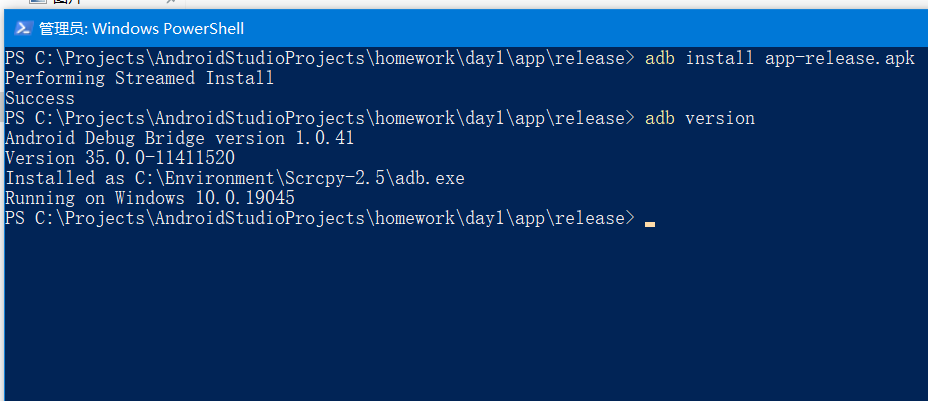
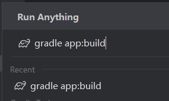

    

        <strong>nj-trainingcollege/miclassroom240819/androidgroup4/tanzhehao</strong>
         
    

    今日课程讲了安卓系统1.0-13的历史、Git简单使用、Gradle简单使用、Adb简单使用，同时由老师带我们配置了AS环境和第一个安卓程序。
     
    
<strong>今日作业</strong>

     

1. [x] 搭建完成AndroidStudio环境，项目能够正常运行展示Hello World。
2. [x] 代码上传到自己的Gitlab仓库。
3. [x] 配置adb命令到环境变量，同时用adb命令安装到手机。
4. [x] 使用gradle命令编译apk。

    <a href="https://partner-gitlab.mioffice.cn/nj-trainingcollege/miclassroom240819/androidgroup4/tanzhehao/homework/-/raw/main/day1/app/release/app-release.apk?inline=false">Download Release App</a>
     
    
<strong>作业截图</strong>

    
    
    

        
        
    

