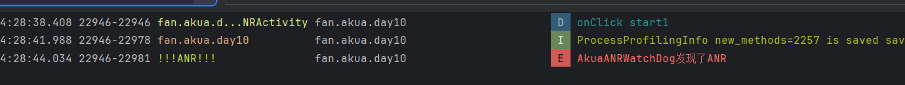

## Day10-HW1

相关的文件如下：

1. [AkuaWatchDog.java](app/src/main/java/fan/akua/day10/utils/watchdog/AkuaWatchDog.java)
2. [CheckStrategy.java](app/src/main/java/fan/akua/day10/utils/watchdog/CheckStrategy.java)
3. [TraditionalStrategy.java](app/src/main/java/fan/akua/day10/utils/watchdog/TraditionalStrategy.java)
4. [HWStrategy.java](app/src/main/java/fan/akua/day10/utils/watchdog/HWStrategy.java)

### 架构设计

大体思路是模仿并扩展ANRWatchDog，先使用策略模式抽象出对ANR的check。

对于ANRWatchDog基类如下（诸如set、get已隐藏）

```java
    @Override
public void run() {
    setName("|Akua-ANR-WatchDog|");
    while (!isInterrupted()) {
        if (_strategy.needPost())
            _handler.post(_strategy.tickMessage());
        try {
            Thread.sleep(_strategy.sleepTime());
        } catch (InterruptedException exception) {
            if (_interruptListener != null)
                _interruptListener.accept(exception);
        }
        if (_anrConsumer != null && _strategy.isANR()) {
            if (!_ignoreDebug && (Debug.isDebuggerConnected() || Debug.waitingForDebugger())) {
                Log.w("AkuaWatchDog", "An ANR was detected but ignored because the debugger is connected (you can prevent this with setIgnoreDebugger(true))");
                continue;
            }
            _anrConsumer.accept(new ANRError());
        }
    }
}
```

策略接口如下

```java
public interface CheckStrategy {
    boolean needPost();

    long sleepTime();

    boolean isANR();

    Runnable tickMessage();
}
```

### 传统检查实现

每5秒检查一次消息

```java
public class TraditionalStrategy implements CheckStrategy {
    private static final int DEFAULT_ANR_TIMEOUT = 5_000;

    private final int _timeoutInterval;
    private final Runnable checkRunnable = new Runnable() {
        @Override
        public void run() {
            _lastTime = 0;
            _reported = false;
        }
    };

    private volatile long _lastTime;
    // 防止报ANR多次。
    private volatile boolean _reported;

    public TraditionalStrategy() {
        this(DEFAULT_ANR_TIMEOUT);
    }

    public TraditionalStrategy(int timeoutInterval) {
        _timeoutInterval = timeoutInterval;
    }

    @Override
    public boolean needPost() {
        return _lastTime == 0;
    }

    @Override
    public long sleepTime() {
        return _timeoutInterval;
    }

    @Override
    public boolean isANR() {
        boolean isANR = _lastTime != 0 && !_reported;
        if (isANR)
            _reported = true;
        return isANR;
    }

    @Override
    public Runnable tickMessage() {
        _lastTime = System.nanoTime();
        return checkRunnable;
    }
}
```

### 扩展检查实现

每1秒发送一次，连续5次超时鉴定为ANR

```java
public class HWStrategy implements CheckStrategy {
    private static final int DEFAULT_ANR_TIMEOUT = 1_000;
    private static final int DEFAULT_ANR_COUNT = 5;

    private final int _timeoutInterval, _threshold;
    private final Runnable checkRunnable = new Runnable() {
        @Override
        public void run() {
            _tickCount.set(0);
            _reported = false;
        }
    };

    private final AtomicInteger _tickCount = new AtomicInteger();
    // 防止报ANR多次。
    private volatile boolean _reported;


    public HWStrategy() {
        this(DEFAULT_ANR_TIMEOUT, DEFAULT_ANR_COUNT);
    }

    public HWStrategy(int threshold) {
        this(DEFAULT_ANR_TIMEOUT, threshold);
    }

    public HWStrategy(int timeoutInterval, int threshold) {
        _timeoutInterval = timeoutInterval;
        _threshold = threshold;
    }

    @Override
    public boolean needPost() {
        return _tickCount.get() < _threshold;
    }

    @Override
    public long sleepTime() {
        return _timeoutInterval;
    }

    @Override
    public boolean isANR() {
        boolean isANR = _tickCount.get() >= _threshold && !_reported;
        if (isANR)
            _reported = true;
        return isANR;
    }

    @Override
    public Runnable tickMessage() {
        _tickCount.incrementAndGet();
        return checkRunnable;
    }
}
```

### 使用

```java
        new AkuaWatchDog(new HWStrategy())
        .setCallBack(new Consumer<ANRError>() {
    @Override
    public void accept(ANRError anrError) {
        Log.e("!!!ANR!!!", "AkuaANRWatchDog发现了ANR");
    }
}).start();
```

### 运行效果如下

