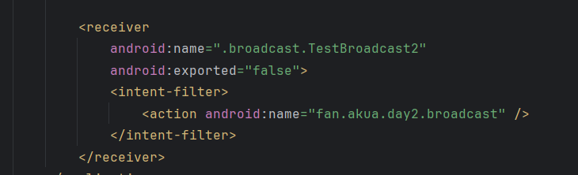
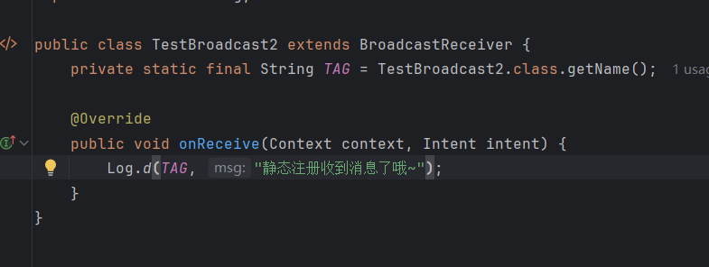
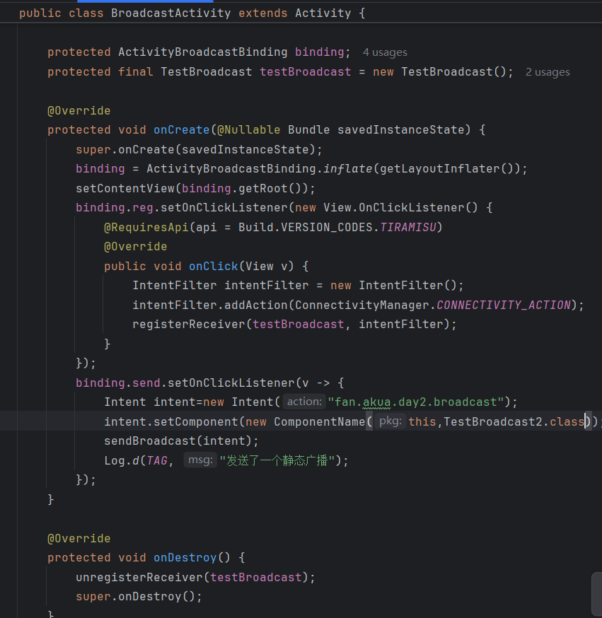

## Day2-HW3

相关的文件如下：
1. [BroadcastActivity.java](https://partner-gitlab.mioffice.cn/nj-trainingcollege/miclassroom240819/androidgroup4/tanzhehao/homework/-/blob/main/day2/app/src/main/java/fan/akua/day2/broadcast/BroadcastActivity.java)
2. [TestBroadcast.java](https://partner-gitlab.mioffice.cn/nj-trainingcollege/miclassroom240819/androidgroup4/tanzhehao/homework/-/blob/main/day2/app/src/main/java/fan/akua/day2/broadcast/TestBroadcast.java)
3. [TestBroadcast2.java](https://partner-gitlab.mioffice.cn/nj-trainingcollege/miclassroom240819/androidgroup4/tanzhehao/homework/-/blob/main/day2/app/src/main/java/fan/akua/day2/broadcast/TestBroadcast2.java)

### 清单注册静态广播

### 编写静态广播处理

### 编写发送广播

值得注意的是，安卓O（8.0）开始，发送静态广播需要指明组件。

### 运行效果如下

[视频无法播放请点击我](https://partner-gitlab.mioffice.cn/nj-trainingcollege/miclassroom240819/androidgroup4/tanzhehao/homework/-/tree/main/day2/pic/20240820_191420.mp4)

    <video src="pic/20240820_191420.mp4"></video>

