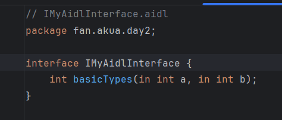
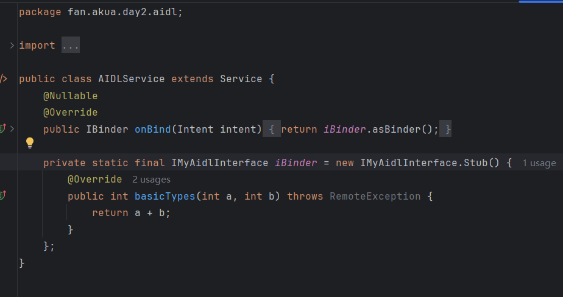
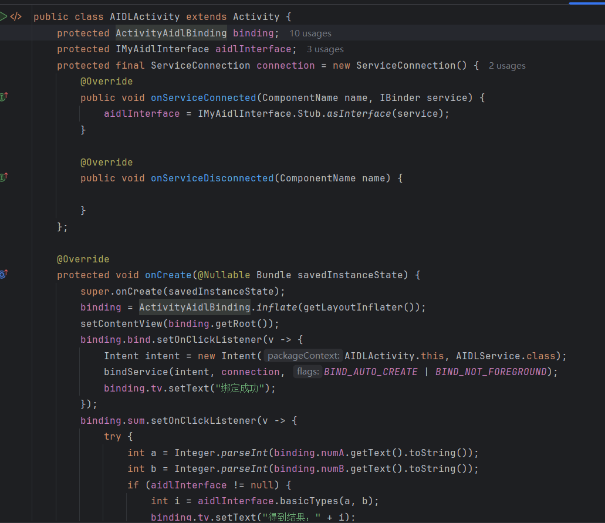

## Day2-Homework4

本次实验使用AIDL定义了一个int加法操作，并返回。

相关的文件如下：
1. [AIDLActivity.java](https://partner-gitlab.mioffice.cn/nj-trainingcollege/miclassroom240819/androidgroup4/tanzhehao/homework/-/blob/main/day2/app/src/main/java/fan/akua/day2/activities/AIDLActivity.java)
2. [IMyAidlInterface.aidl](https://partner-gitlab.mioffice.cn/nj-trainingcollege/miclassroom240819/androidgroup4/tanzhehao/homework/-/blob/main/day2/app/src/main/aidl/fan/akua/day2/IMyAidlInterface.aidl)
3. [AIDLService.java](https://partner-gitlab.mioffice.cn/nj-trainingcollege/miclassroom240819/androidgroup4/tanzhehao/homework/-/blob/main/day2/app/src/main/java/fan/akua/day2/aidl/AIDLService.java)

### 声明AIDL

### 编写Service

### 编写Activity

### 运行效果如下

[视频无法播放请点击我](https://partner-gitlab.mioffice.cn/nj-trainingcollege/miclassroom240819/androidgroup4/tanzhehao/homework/-/tree/main/day2/pic/Screen_recording_20240820_184413.mp4)

    <video src="pic/Screen_recording_20240820_184413.mp4"></video>

