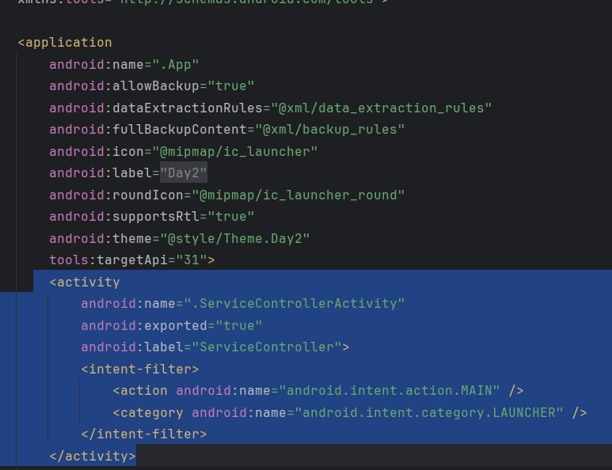

## Day2-Train1

相关的文件如下：
1. [App.java](https://partner-gitlab.mioffice.cn/nj-trainingcollege/miclassroom240819/androidgroup4/tanzhehao/homework/-/blob/main/day2/app/src/main/java/fan/akua/day2/App.java)
2. [ServiceControllerActivity.java](https://partner-gitlab.mioffice.cn/nj-trainingcollege/miclassroom240819/androidgroup4/tanzhehao/homework/-/blob/main/day2/app/src/main/java/fan/akua/day2/activities/ServiceControllerActivity.java)

### 直接在Application中注册Activity周期回调


### 在清单中声明Activity和Application



### 使用ADB启动指定Activity

`adb shell am start -n fan.akua.day2/fan.akua.day2.ServiceControllerActivity`


### 观察日志

`package:mine level:debug tag=:fan.akua.day2.App`


此时回到桌面


再返回程序


用返回键退出程序


### 小结

Activity的生命周期如下

```text
+ - - - - - - - - - - -+
'  Activity LifeCycle  '
'                      '
' +------------------+ '
' |     onCreate     | '
' +------------------+ '
'   |                  '
'   | 可见               '
'   v                  '
' +------------------+ '
' |     onStart      | '
' +------------------+ '
'   |                  '
'   | 可交换              '
'   v                  '
' +------------------+ '
' |     onResume     | '
' +------------------+ '
'   |                  '
'   | 不可交互             '
'   v                  '
' +------------------+ '
' |     onPause      | '
' +------------------+ '
'   |                  '
'   | 不可见              '
'   v                  '
' +------------------+ '
' |      onStop      | '
' +------------------+ '
'   |                  '
'   | 销毁               '
'   v                  '
' +------------------+ '
' |    onDestroy     | '
' +------------------+ '
'                      '
+ - - - - - - - - - - -+

```