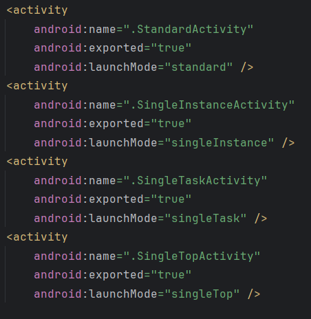

## Day2-Train2

相关的文件如下：
1. [SingleInstanceActivity.java](https://partner-gitlab.mioffice.cn/nj-trainingcollege/miclassroom240819/androidgroup4/tanzhehao/homework/-/blob/main/day2/app/src/main/java/fan/akua/day2/launchMode/SingleInstanceActivity.java)
2. [SingleTaskActivity.java](https://partner-gitlab.mioffice.cn/nj-trainingcollege/miclassroom240819/androidgroup4/tanzhehao/homework/-/blob/main/day2/app/src/main/java/fan/akua/day2/launchMode/SingleTaskActivity.java)
3. [SingleTopActivity.java](https://partner-gitlab.mioffice.cn/nj-trainingcollege/miclassroom240819/androidgroup4/tanzhehao/homework/-/blob/main/day2/app/src/main/java/fan/akua/day2/launchMode/SingleTopActivity.java)
4. [StandardActivity.java](https://partner-gitlab.mioffice.cn/nj-trainingcollege/miclassroom240819/androidgroup4/tanzhehao/homework/-/blob/main/day2/app/src/main/java/fan/akua/day2/launchMode/StandardActivity.java)

### 声明不同启动模式的Activity



### 添加日志

得益于在Application中的监听，除onNewIntent外的周期可由Application监听。


### 设计场景

四种启动模式对应四种场景：

- Standard启动模式:
  场景:用户打开App,进入了Activity A。然后用户点击某个按钮,跳转到Activity B。此时Activity A仍然存在,B被推到任务栈顶。

- SingleTop启动模式:
  场景:用户打开App,进入了Activity A。然后用户点击某个按钮,再次进入Activity A。此时不会创建新的A实例,而是复用了已有的A实例，同时调用onNewIntent。

- SingleTask启动模式:
  场景:用户打开App,进入了Activity A。然后用户点击某个按钮,跳转到Activity B。此时再次启动Activity A，则B将会被清除,A调用onNewIntent。

- SingleInstance启动模式:
  场景:用户打开App,进入了Activity A。然后用户点击某个按钮,跳转到Activity B。此时Activity B会在一个新的任务栈中创建,与A的任务栈分离。再次打开App,会直接进入Activity A,因为B是独立的任务栈。

#### 场景一

设计场景一的脚本

```shell
#!/bin/bash

PACKAGE_NAME="fan.akua.day2"
ACTIVITY_A="fan.akua.day2.launchMode.StandardActivity"
ACTIVITY_B="fan.akua.day2.launchMode.DefaultActivity"

# 杀死已存在的进程
adb shell am force-stop $PACKAGE_NAME &> /dev/null

# 启动Standard的Activity A
adb shell am start -n $PACKAGE_NAME/$ACTIVITY_A

sleep 2
# 查看栈顶Activity
adb -d shell dumpsys activity activities | grep mResumedActivity

sleep 2
# 启动Activity B
adb shell am start -n $PACKAGE_NAME/$ACTIVITY_B

sleep 2
# 查看栈顶Activity
adb -d shell dumpsys activity activities | grep mResumedActivity
```

查看日志


栈顶先是fan.akua.day2/.launchMode.StandardActivity
启动fan.akua.day2/.launchMode.DefaultActivity后变为后者

接下来按下返回


DefaultActivity销毁，StandardActivity回到栈顶（不调用onNewIntent）

#### 场景二

设计场景二的脚本

```shell
#!/bin/bash

PACKAGE_NAME="fan.akua.day2"
ACTIVITY_A="fan.akua.day2.launchMode.SingleTopActivity"

# 杀死已存在的进程
adb shell am force-stop $PACKAGE_NAME &> /dev/null

# 启动SingleTop的Activity A
adb shell am start -n $PACKAGE_NAME/$ACTIVITY_A

sleep 2
# 查看栈顶Activity
adb -d shell dumpsys activity activities | grep mResumedActivity

# 再次启动SingleTop的Activity A
adb shell am start -n $PACKAGE_NAME/$ACTIVITY_A

sleep 2
# 查看栈顶Activity
adb -d shell dumpsys activity activities | grep mResumedActivity
```

查看日志


当A处于栈顶时，再次启动A，不会创建新的实例，而是调用A的onNewIntent，同时恢复可交互状态

#### 场景三

设计场景三的脚本

```shell
#!/bin/bash

PACKAGE_NAME="fan.akua.day2"
ACTIVITY_A="fan.akua.day2.launchMode.SingleTaskActivity"
ACTIVITY_B="fan.akua.day2.launchMode.DefaultActivity"

# 杀死已存在的进程
adb shell am force-stop $PACKAGE_NAME &> /dev/null

# 启动SingleTask的Activity A
adb shell am start -n $PACKAGE_NAME/$ACTIVITY_A

sleep 2
# 查看栈顶Activity
adb -d shell dumpsys activity activities | grep mResumedActivity

# 启动Activity B
adb shell am start -n $PACKAGE_NAME/$ACTIVITY_B

sleep 2
# 查看栈顶Activity
adb -d shell dumpsys activity activities | grep mResumedActivity

sleep 2
# 再次启动SingleTask的Activity A
adb shell am start -n $PACKAGE_NAME/$ACTIVITY_A

sleep 2
# 查看栈顶Activity
adb -d shell dumpsys activity activities | grep mResumedActivity
```

查看日志


第一次启动ActivityA时，他在Task1中。
接下来启动ActivityB，创建了一个新的Task。
再启动ActivityA，因为ActivityA在Task1中，所以ActivityB被出栈，ActivityA回到栈顶，并调用onNewIntent

#### 场景四

设计场景四的脚本

```shell
#!/bin/bash

PACKAGE_NAME="fan.akua.day2"
ACTIVITY_A="fan.akua.day2.launchMode.SingleInstanceActivity"
ACTIVITY_B="fan.akua.day2.launchMode.DefaultActivity"

# 杀死已存在的进程
adb shell am force-stop $PACKAGE_NAME &> /dev/null

# 启动SingleInstance的Activity A
adb shell am start -n $PACKAGE_NAME/$ACTIVITY_A

sleep 2
# 查看栈顶Activity
adb -d shell dumpsys activity activities | grep mResumedActivity

sleep 2
# 启动Activity B
adb shell am start -n $PACKAGE_NAME/$ACTIVITY_B

sleep 2
# 查看栈顶Activity
adb -d shell dumpsys activity activities | grep mResumedActivity

# 再次启动SingleInstance的Activity A
adb shell am start -n $PACKAGE_NAME/$ACTIVITY_A

sleep 2
# 查看栈顶Activity
adb -d shell dumpsys activity activities | grep mResumedActivity
```

查看日志


可以看到，B并没有被销毁。
此时有两个任务栈

按两下退出，栈数量减少


