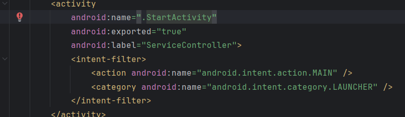

## Day2-Train3

相关的文件如下：
1. [IntentActivity.java](https://partner-gitlab.mioffice.cn/nj-trainingcollege/miclassroom240819/androidgroup4/tanzhehao/homework/-/blob/main/day2/app/src/main/java/fan/akua/day2/activities/IntentActivity.java)

### 在清单声明Activity

### 编写XML

### 编写代码

### 运行效果如下

[视频无法播放请点击我](https://partner-gitlab.mioffice.cn/nj-trainingcollege/miclassroom240819/androidgroup4/tanzhehao/homework/-/tree/main/day2/pic/Screen_recording_20240820_105620.mp4)

    <video src="pic/Screen_recording_20240820_105620.mp4"></video>

