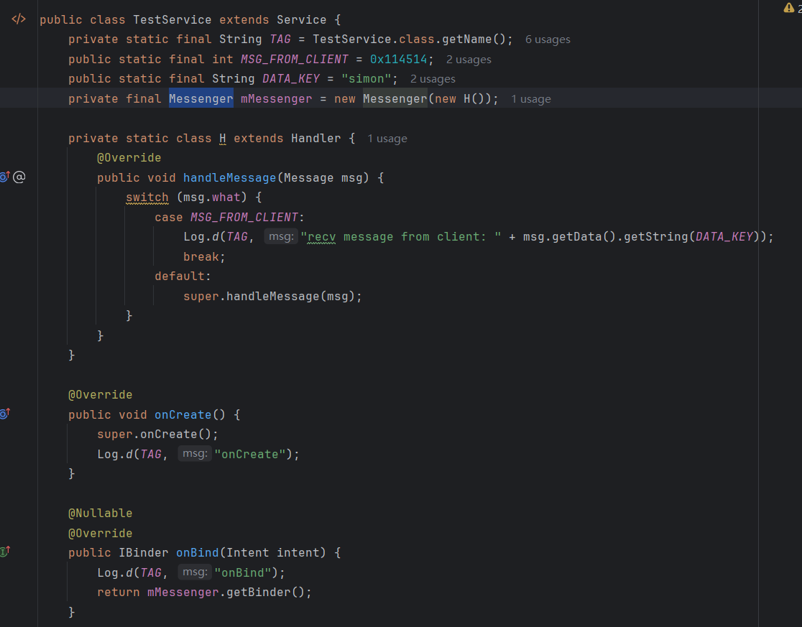
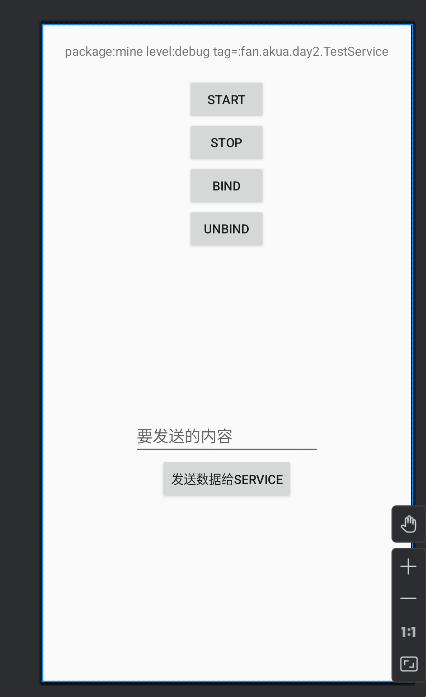

## Day2-Train4

这里选择Messenger

相关的文件如下：
1. [TestService.java](https://partner-gitlab.mioffice.cn/nj-trainingcollege/miclassroom240819/androidgroup4/tanzhehao/homework/-/blob/main/day2/app/src/main/java/fan/akua/day2/service/TestService.java)
2. [ServiceControllerActivity.java](https://partner-gitlab.mioffice.cn/nj-trainingcollege/miclassroom240819/androidgroup4/tanzhehao/homework/-/blob/main/day2/app/src/main/java/fan/akua/day2/activities/ServiceControllerActivity.java)

### 清单声明独立进程的service


### 定义Messeenger



### 编写Activity代码

在Activity中定义startService、stopService、bindService、unbindService操作


### 编写xml



### 运行效果如下

[视频无法播放请点击我](https://partner-gitlab.mioffice.cn/nj-trainingcollege/miclassroom240819/androidgroup4/tanzhehao/homework/-/tree/main/day2/pic/20240820_140349.mp4)

<div>
    <video src="pic/20240820_140349.mp4"></video>
</div>

### 小结
值得注意的是，并非一直启动模式对应一种生命周期。Service可以同时被两种启动模式启动。在此情况下，如果想要结束Service，需要同时stop和unbind。

所有其真实的生命周期如下所示

```text
+ - - - - - - - - - - - -+
'  Android Service 生命周期  '
'                        '
' +--------------------+ '
' |      onCreate      | '
' +--------------------+ '
'   |                    '
'   | startService       '
'   v                    '
' +--------------------+ '
' |   onStartCommand   | '
' +--------------------+ '
'   |                    '
'   | 绑定                '
'   v                    '
' +--------------------+ '
' |       onBind       | '
' +--------------------+ '
'   |                    '
'   | 解绑                '
'   v                    '
' +--------------------+ '
' |      onUnbind      | '
' +--------------------+ '
'   |                    '
'   | 销毁                '
'   v                    '
' +--------------------+ '
' |     onDestroy      | '
' +--------------------+ '
'                        '
+ - - - - - - - - - - - -+
```