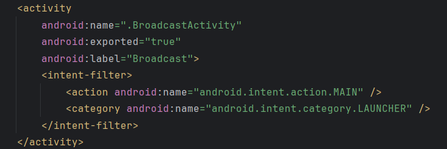
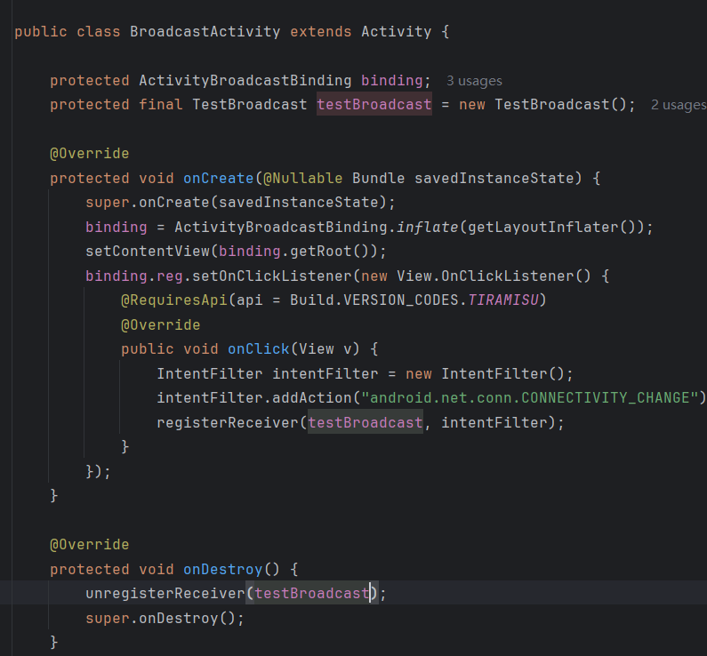
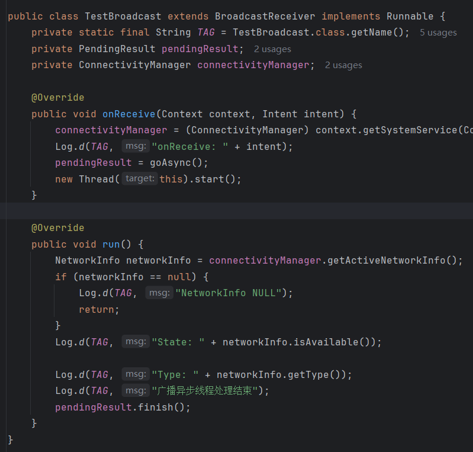

## Day2-Train5

我选择监听网络变化

相关的文件如下：
1. [BroadcastActivity.java](https://partner-gitlab.mioffice.cn/nj-trainingcollege/miclassroom240819/androidgroup4/tanzhehao/homework/-/blob/main/day2/app/src/main/java/fan/akua/day2/broadcast/BroadcastActivity.java)
2. [TestBroadcast.java](https://partner-gitlab.mioffice.cn/nj-trainingcollege/miclassroom240819/androidgroup4/tanzhehao/homework/-/blob/main/day2/app/src/main/java/fan/akua/day2/broadcast/TestBroadcast.java)

### 先在清单声明Activity

### 编写Activity代码

### 编写BroadcastReceiver代码

### 查看日志

logcat过滤器为`package:mine level:debug tag=:fan.akua.day2.TestBroadcast`

### 运行效果如下

[视频无法播放请点击我](https://partner-gitlab.mioffice.cn/nj-trainingcollege/miclassroom240819/androidgroup4/tanzhehao/homework/-/tree/main/day2/pic/20240820_151420.mp4)

    <video src="pic/20240820_151420.mp4"></video>

### 小结

实际上安卓有三大类广播：**无序广播**、**有序广播**、**粘性广播**。
本次实验使用的为无序广播。没有进一步实验有一些可惜。
对于广播来说，他是一种**事件总线**，在安卓中一般通过动态注册来被动接受一些消息。