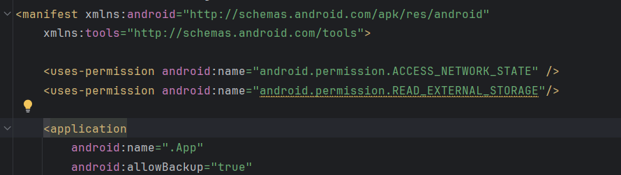
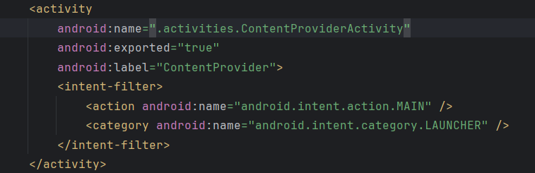
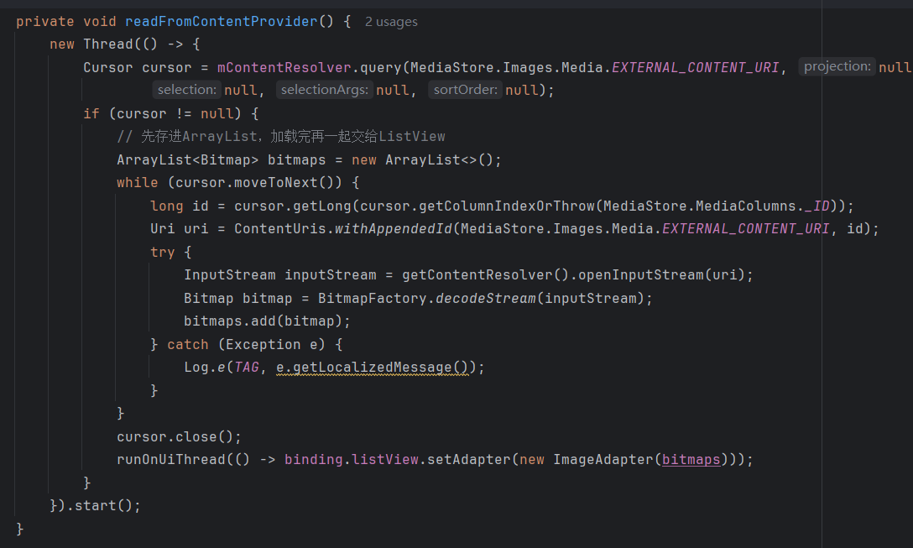

## Day2-Train6

相关的文件如下：
1. [ContentProviderActivity.java](https://partner-gitlab.mioffice.cn/nj-trainingcollege/miclassroom240819/androidgroup4/tanzhehao/homework/-/blob/main/day2/app/src/main/java/fan/akua/day2/activities/ContentProviderActivity.java)

### 清单声明

先声明权限

声明Activity

、

### 编写代码

代码主要分为三部分：动态权限申请、读取Bitmap、交给ListView展示。

这里我只取第二部分，这部分和ContentProvider操作较为密切。

### 运行效果如下

[视频无法播放请点击我](https://partner-gitlab.mioffice.cn/nj-trainingcollege/miclassroom240819/androidgroup4/tanzhehao/homework/-/tree/main/day2/pic/Screen_recording_20240820_193755.mp4)

    <video src="pic/Screen_recording_20240820_193755.mp4"></video>

