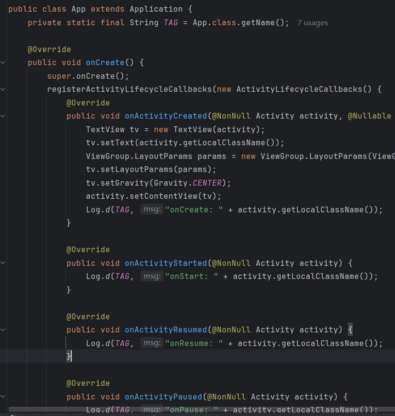
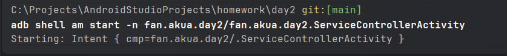
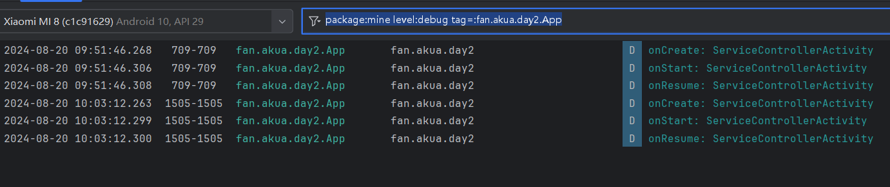
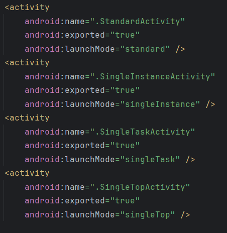
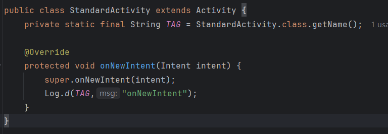
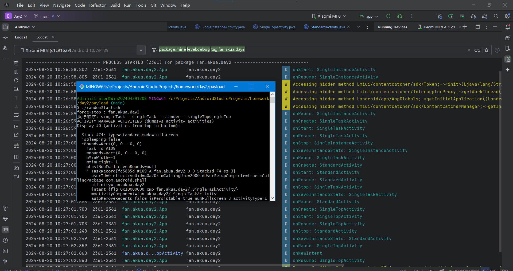
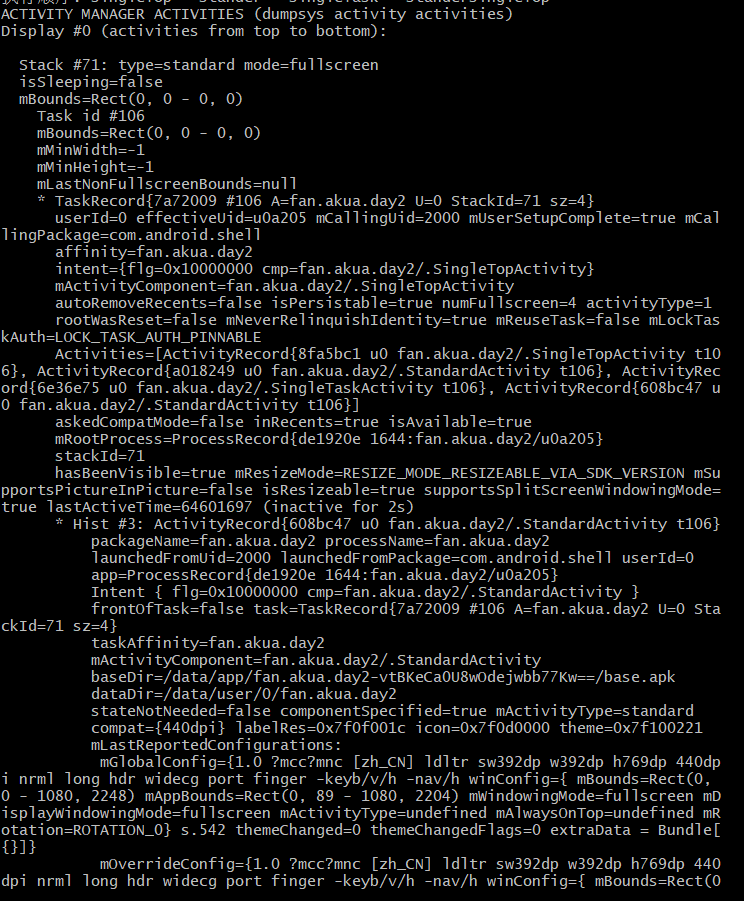
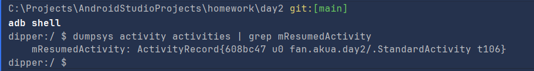

<div>
    <p align="center">
        <strong>nj-trainingcollege/miclassroom240819/androidgroup4/tanzhehao</strong>
        <br>
    </p>
    今日课程讲了简单介绍四大组件；了解Activity生命周期；logcat使用；dumpsys查看Activity栈；
    <br><br>
    <p align="center"><strong>课堂练习</strong></p>
    <br>
</div>

1. [x] 新建Activity，通过日志打印，熟悉生命周期执行顺序。
2. [x] 为Activity设置不同的启动模式并通过adb命令进行查看栈信息，同时打印生命周期日志。（注意：要打印onNewIntent周期）

<div>
    <br>
    <p align="center"><strong>今日作业</strong></p>
    <br>
</div>

1. [x] 新建Activity，通过日志打印，熟悉生命周期执行顺序。


## 练习报告

### 任务一

直接在Application中注册Activity周期回调



再去清单中声明Activity和Application


然后`adb shell am start -n fan.akua.day2/fan.akua.day2.ServiceControllerActivity`



设置过滤器观察日志

`package:mine level:debug tag=:fan.akua.day2.App`



### 任务二

声明不同启动模式的Activity



得益于在Application中的监听，除onNewIntent外的周期由Application监听



编写一个随机批量启动脚本

```shell
#/bin/sh

# adb logcat 过滤规则为 package:mine level:debug tag=:fan.akua.day2.App

APP_PACKAGE="fan.akua.day2"
StandardActivity_CLASS="$APP_PACKAGE.StandardActivity"
SingleInstanceActivity_CLASS="$APP_PACKAGE.SingleInstanceActivity"
SingleTaskActivity_CLASS="$APP_PACKAGE.SingleTaskActivity"
SingleTopActivity_CLASS="$APP_PACKAGE.SingleTopActivity"

if ! command -v adb &> /dev/null
then
    echo "你的ADB呢？？"
    exit 1
fi

function stop_app() {
    adb shell am force-stop $1 &> /dev/null
    echo "force-stop : $APP_PACKAGE"
}

function startStander() {
    adb shell am start -n $APP_PACKAGE/$StandardActivity_CLASS &> /dev/null
    echo "stander"
}

function startSingleTask() {
    adb shell am start -n $APP_PACKAGE/$SingleInstanceActivity_CLASS &> /dev/null
    echo "singleTask"
}

function startSingleTaskActivity() {
    adb shell am start -n $APP_PACKAGE/$SingleTaskActivity_CLASS &> /dev/null
    echo "singleTask"
}
function startSingleTopActivity() {
    adb shell am start -n $APP_PACKAGE/$SingleTopActivity_CLASS &> /dev/null
    echo "singleTop"
}

stop_app $APP_PACKAGE

functions=(startStander startSingleTask startSingleTaskActivity startSingleTopActivity)
result=""
for i in {1..5}; do
    func_name=${functions[$((RANDOM % ${#functions[@]}))]}
    result+=$($func_name)
    sleep 1
    if [ $i -lt 4 ]; then
        result+=" - "
    fi
done

echo "执行顺序: $result"
adb shell dumpsys activity activities
```

设置logcat过滤`package:mine level:debug tag:fan.akua.day2`

启动脚本



查看栈信息



较为关键的是`state=`、`launchMode=`参数

查看当前栈顶Activity的指令如下
```shell
adb -d shell dumpsys activity activities | grep mResumedActivity
```

