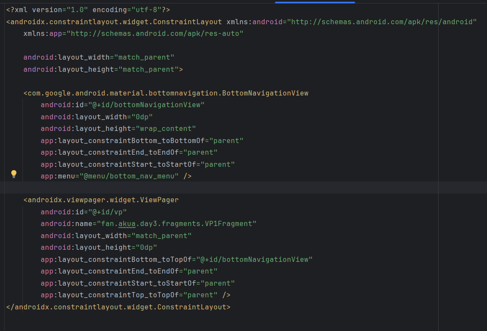
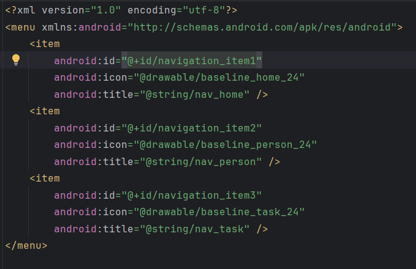
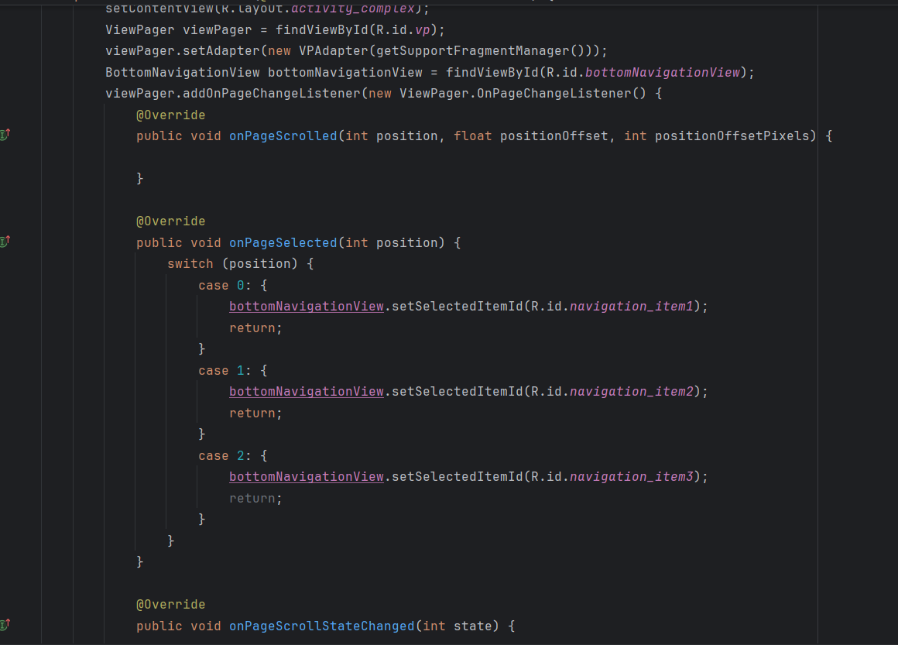
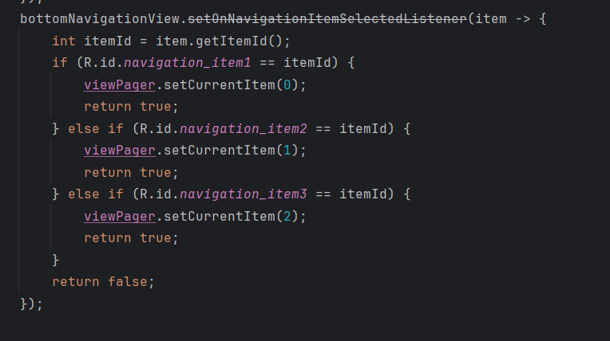
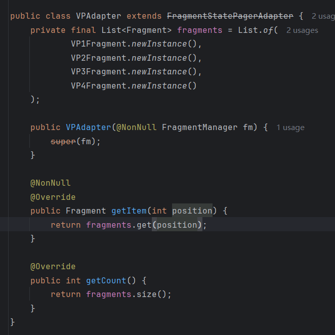

## Day3-HW1

相关的文件如下：

1. [ComplexActivity.java](https://partner-gitlab.mioffice.cn/nj-trainingcollege/miclassroom240819/androidgroup4/tanzhehao/homework/-/blob/main/day3/app/src/main/java/fan/akua/day3/activities/ComplexActivity.java)
2. [activity_complex.xml](https://partner-gitlab.mioffice.cn/nj-trainingcollege/miclassroom240819/androidgroup4/tanzhehao/homework/-/blob/main/day3/app/src/main/res/layout/activity_complex.xml)
3. [bottom_nav_menu.xml](https://partner-gitlab.mioffice.cn/nj-trainingcollege/miclassroom240819/androidgroup4/tanzhehao/homework/-/blob/main/day3/app/src/main/res/menu/bottom_nav_menu.xml)

### 编写布局

就这样吧，**ConstraintLayout**+**ViewPager**+**BottomNavigationView**方案。布局如下：

### 完成联动效果

首先需要编写menu

然后就是重量级Activity，主要三部分：ViewPager滑动改变BottomNavigation；BottomNagivation点击item改变ViewPager；ViewPager绑定Fragment；

第三部分直接复用作业二中的适配器

### 运行效果如下

[视频无法播放请点击我](https://partner-gitlab.mioffice.cn/nj-trainingcollege/miclassroom240819/androidgroup4/tanzhehao/homework/-/tree/main/day3/vx_images/Screen_recording_20240821_191925.mp4)

    <video src="vx_images/Screen_recording_20240821_191925.mp4"></video>

