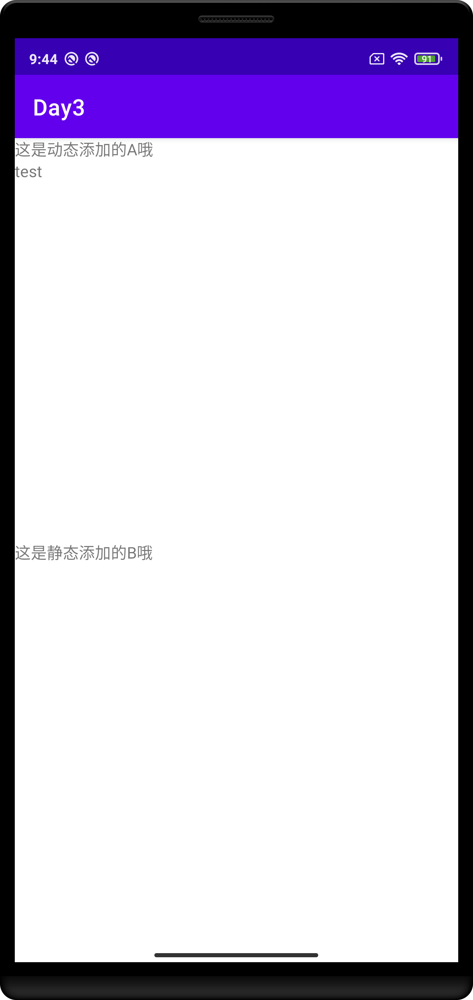

## Day3-Train1

相关的文件如下：
1. [AFragment.java](https://partner-gitlab.mioffice.cn/nj-trainingcollege/miclassroom240819/androidgroup4/tanzhehao/homework/-/blob/main/day3/app/src/main/java/fan/akua/day3/fragments/AFragment.java)
2. [BFragment.java](https://partner-gitlab.mioffice.cn/nj-trainingcollege/miclassroom240819/androidgroup4/tanzhehao/homework/-/blob/main/day3/app/src/main/java/fan/akua/day3/fragments/BFragment.java)
3. [MainActivity.java](https://partner-gitlab.mioffice.cn/nj-trainingcollege/miclassroom240819/androidgroup4/tanzhehao/homework/-/blob/main/day3/app/src/main/java/fan/akua/day3/activities/MainActivity.java)

### 先编写布局

对于activity_main的布局，如下

对于AFragment的布局如下，他是动态添加的

对于BFragment的布局如下，他是静态添加的

### 编写Activity代码

很简单，当也需要注意：**Fragment在Activity重启时会自动重新创建，为了避免重复创建需要判断savedInstanceState。**

### 编写Fragment

值得注意的是：**Fragment在自动创建时，使用的是反射，且只使用无参构造函数。一个Fragment必须声明无参构造，同时对于动态注册的Fragment，如果需要传输数据，最好进行一次封装。**

### 运行效果如下

