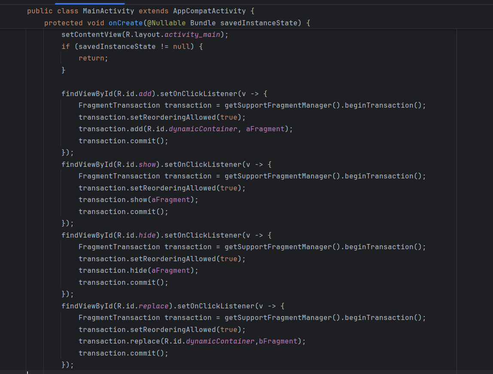

## Day3-Train2

相关的文件如下：
1. [AFragment.java](https://partner-gitlab.mioffice.cn/nj-trainingcollege/miclassroom240819/androidgroup4/tanzhehao/homework/-/blob/main/day3/app/src/main/java/fan/akua/day3/fragments/AFragment.java)
2. [BFragment.java](https://partner-gitlab.mioffice.cn/nj-trainingcollege/miclassroom240819/androidgroup4/tanzhehao/homework/-/blob/main/day3/app/src/main/java/fan/akua/day3/fragments/BFragment.java)
3. [MainActivity.java](https://partner-gitlab.mioffice.cn/nj-trainingcollege/miclassroom240819/androidgroup4/tanzhehao/homework/-/blob/main/day3/app/src/main/java/fan/akua/day3/activities/MainActivity.java)

### 先编写布局

对于activity_main的布局，如下

Add操作会添加一个Fragment
Hide操作会隐藏添加的Fragment
Show操作会显示添加的Fragment
Replace操作会替换添加的Fragment

### 编写代码

### 运行效果如下

[视频无法播放请点击我](https://partner-gitlab.mioffice.cn/nj-trainingcollege/miclassroom240819/androidgroup4/tanzhehao/homework/-/tree/main/day3/vx_images/Screen_recording_20240821_102410.mp4)

    <video src="vx_images/Screen_recording_20240821_102410.mp4"></video>

