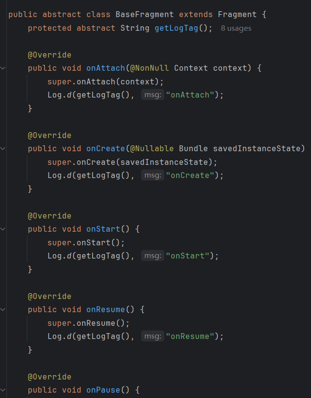
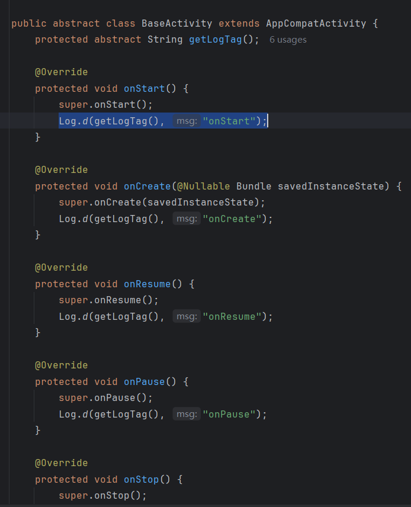
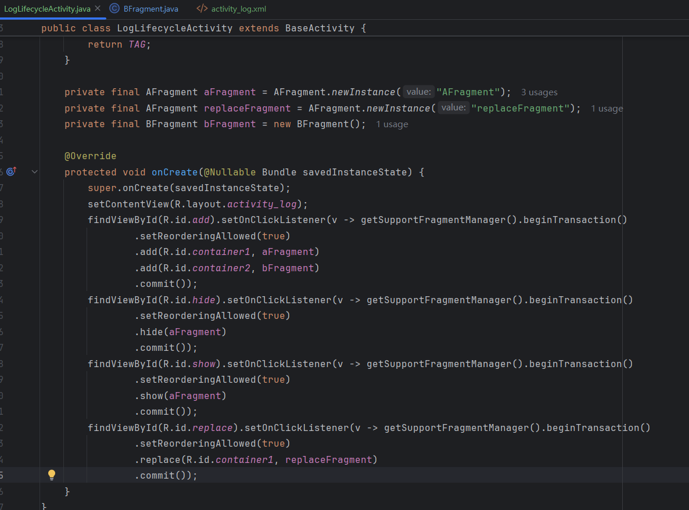
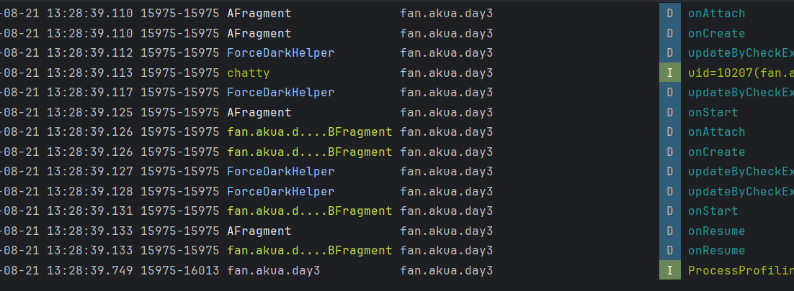
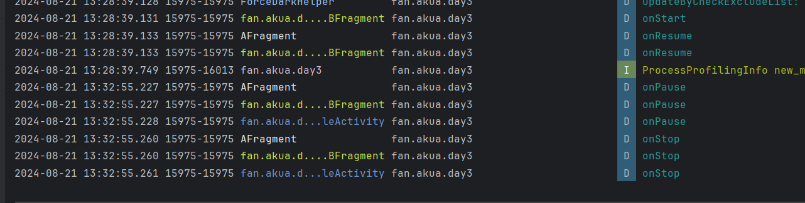
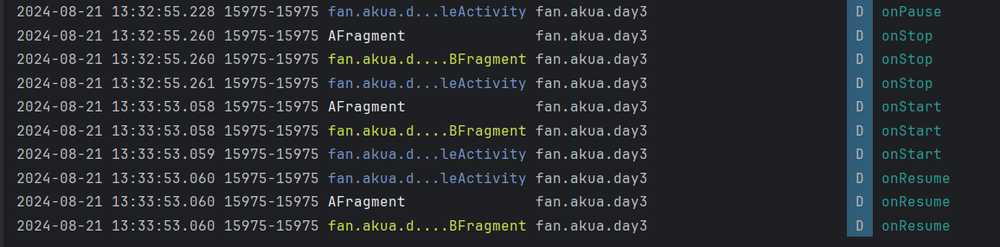
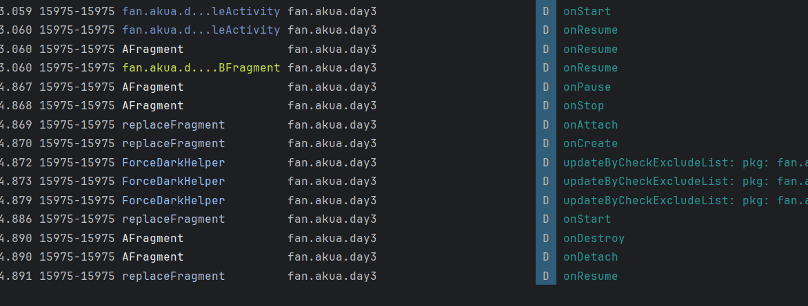

## Day3-Train3

相关的文件如下：
1. [AFragment.java](https://partner-gitlab.mioffice.cn/nj-trainingcollege/miclassroom240819/androidgroup4/tanzhehao/homework/-/blob/main/day3/app/src/main/java/fan/akua/day3/fragments/AFragment.java)
2. [BFragment.java](https://partner-gitlab.mioffice.cn/nj-trainingcollege/miclassroom240819/androidgroup4/tanzhehao/homework/-/blob/main/day3/app/src/main/java/fan/akua/day3/fragments/BFragment.java)
3. [MainActivity.java](https://partner-gitlab.mioffice.cn/nj-trainingcollege/miclassroom240819/androidgroup4/tanzhehao/homework/-/blob/main/day3/app/src/main/java/fan/akua/day3/activities/MainActivity.java)

### 定义基类

在基类中，重写各生命周期并打印。

    
    

### 编写Activity交换类

### 查看日志

首先点击Add按钮，日志如下

很明显，add后，被添加的Fragment按顺序执行

onAttach - > onCreate - > onStart

随后，当本次事务的所有操作结束后，会执行每个被添加Fragment的onResume

再次点击hide

日志不变，不执行任何生命周期，View的可见模式被设置为Gone

再次点击show

日志不变，不执行任何生命周期，View的可见模式恢复

点击Home返回桌面

由添加Fragment的顺序，依次执行

onPause - > onStop

再次返回程序

可以看到生命周期与Activity类似，执行顺序如下

onStart - > onResume

点击Replace

FragmentA被替换为replaceFragment
FragmentA执行 onPause - > onStop
随后replaceFragment进入，执行 onAttach - > onCreate - > onStart

这时replaceFragment即将可见，需要清理FragmentA。
FragmentA继续执行 onDestroy - > onDetach
这是FragmentA被彻底清除，replaceFragment出现，执行 onResume