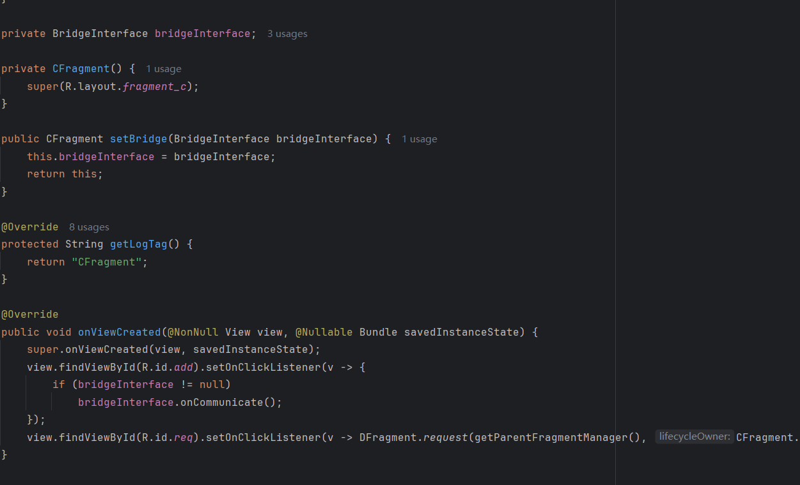
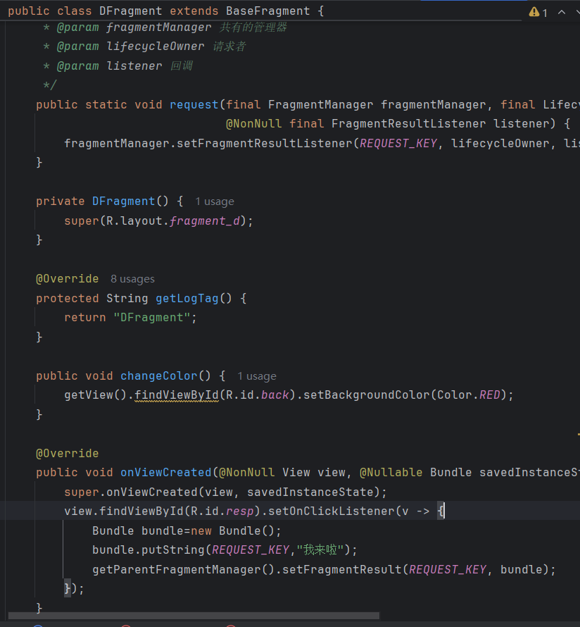
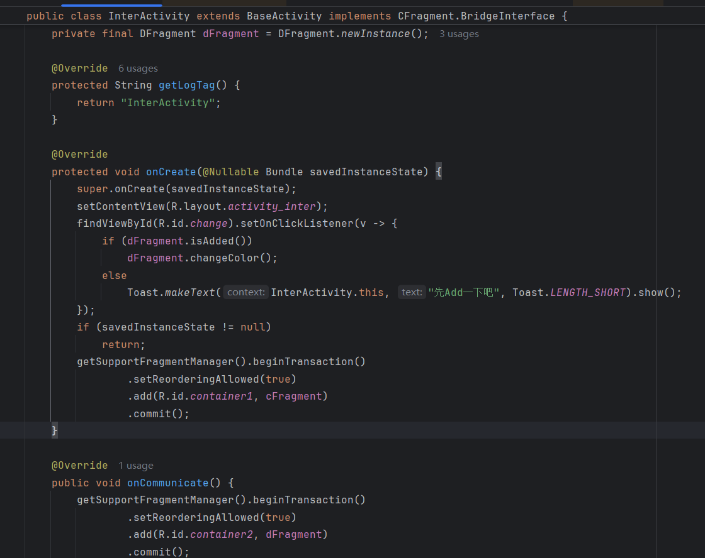

## Day3-Train4

相关的文件如下：
1. [InterActivity.java](https://partner-gitlab.mioffice.cn/nj-trainingcollege/miclassroom240819/androidgroup4/tanzhehao/homework/-/blob/main/day3/app/src/main/java/fan/akua/day3/activities/InterActivity.java)
2. [CFragment.java](https://partner-gitlab.mioffice.cn/nj-trainingcollege/miclassroom240819/androidgroup4/tanzhehao/homework/-/blob/main/day3/app/src/main/java/fan/akua/day3/fragments/CFragment.java)
3. [DFragment.java](https://partner-gitlab.mioffice.cn/nj-trainingcollege/miclassroom240819/androidgroup4/tanzhehao/homework/-/blob/main/day3/app/src/main/java/fan/akua/day3/fragments/DFragment.java)

### 定义布局

### 编写两个Fragment的代码

    
    

### 编写Activity代码

### 运行效果如下

[视频无法播放请点击我](https://partner-gitlab.mioffice.cn/nj-trainingcollege/miclassroom240819/androidgroup4/tanzhehao/homework/-/tree/main/day3/vx_images/Screen_recording_20240821_142211.mp4)

    <video src="vx_images/Screen_recording_20240821_142211.mp4"></video>

