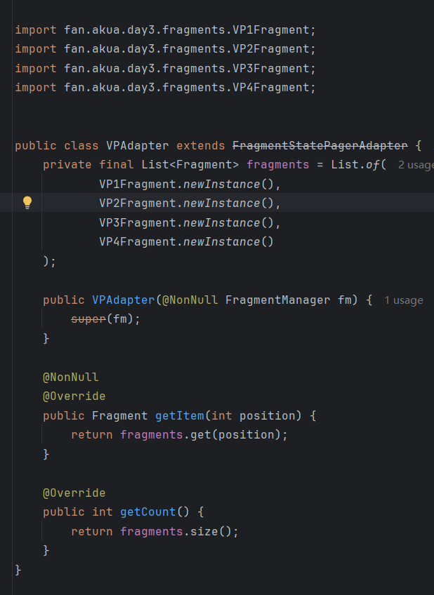

## Day3-Train5

相关的文件如下：

1. [VPAdapter.java](https://partner-gitlab.mioffice.cn/nj-trainingcollege/miclassroom240819/androidgroup4/tanzhehao/homework/-/blob/main/day3/app/src/main/java/fan/akua/day3/adapters/VPAdapter.java)
2. [VP1Fragment.java](https://partner-gitlab.mioffice.cn/nj-trainingcollege/miclassroom240819/androidgroup4/tanzhehao/homework/-/blob/main/day3/app/src/main/java/fan/akua/day3/fragments/VP1Fragment.java)
3. [VP2Fragment.java](https://partner-gitlab.mioffice.cn/nj-trainingcollege/miclassroom240819/androidgroup4/tanzhehao/homework/-/blob/main/day3/app/src/main/java/fan/akua/day3/fragments/VP2Fragment.java)
4. [VP3Fragment.java](https://partner-gitlab.mioffice.cn/nj-trainingcollege/miclassroom240819/androidgroup4/tanzhehao/homework/-/blob/main/day3/app/src/main/java/fan/akua/day3/fragments/VP3Fragment.java)
5. [VP4Fragment.java](https://partner-gitlab.mioffice.cn/nj-trainingcollege/miclassroom240819/androidgroup4/tanzhehao/homework/-/blob/main/day3/app/src/main/java/fan/akua/day3/fragments/VP4Fragment.java)
6. [VPActivity.java](https://partner-gitlab.mioffice.cn/nj-trainingcollege/miclassroom240819/androidgroup4/tanzhehao/homework/-/blob/main/day3/app/src/main/java/fan/akua/day3/activities/VPActivity.java)

### 编写四个Fragment

得益于BaseFragment，不需要额外编写日志回调

    
    

    
    

### 编写适配器

### 查看日志

初始时，页面只展示出vp1，但是实际上vp1和vp2都执行了onResume。
接下来滑动一次

这是vp3也执行了onResume。
再次滑动

可以看到vp4执行了onResume，同时vp1执行了onDetach。
继续滑动。

可以看到vp2执行了onDetach。
向左滑动一次。

vp2重新创建，同时执行了onResume。
再次滑动。

vp1执行了onResume，vp4执行了onDetach。

### 总结

viewpager使用FragmentStatePagerAdapter类型的适配器时，最多同时存在3个Fragment，当前展示的页面和左右临近的一个页面。