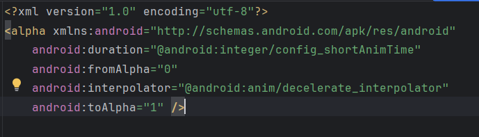
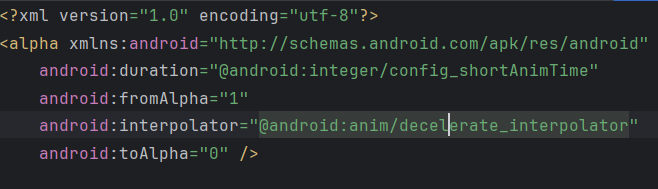
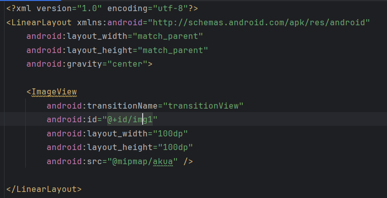
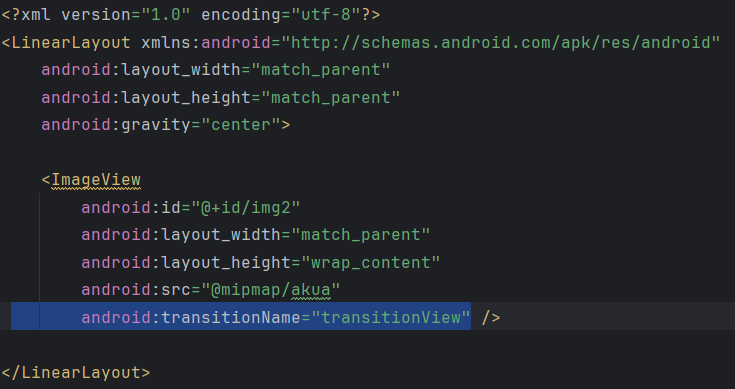
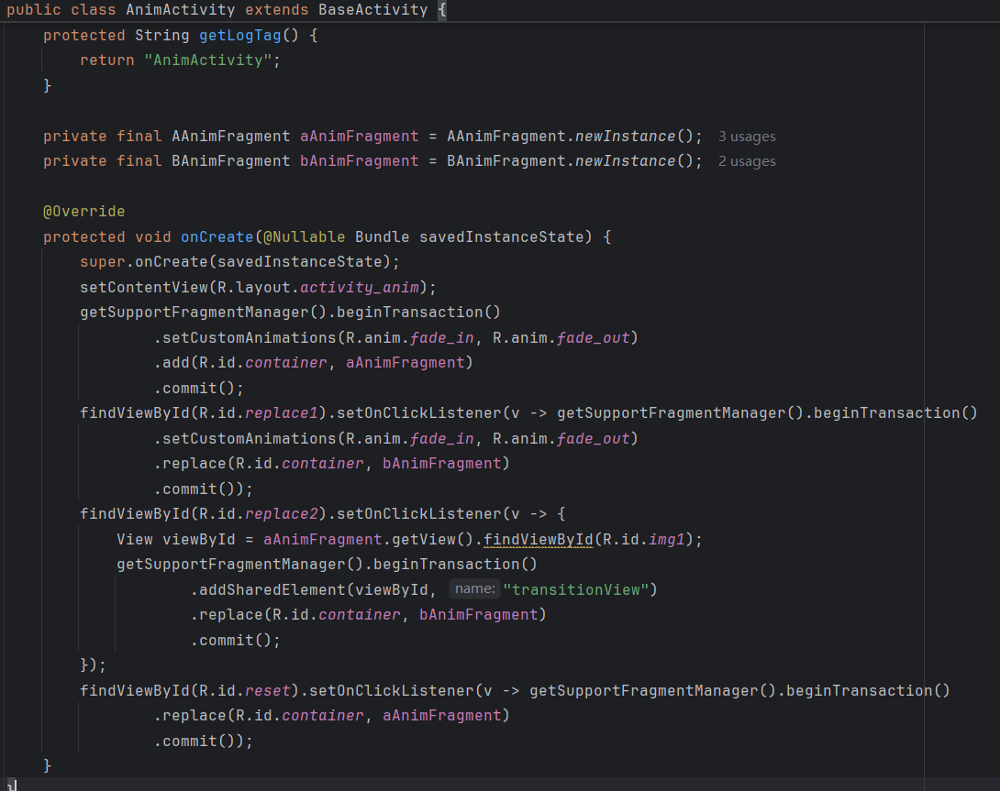

## Day3-Train6

相关的文件如下：

1. [fade_in.xml](https://partner-gitlab.mioffice.cn/nj-trainingcollege/miclassroom240819/androidgroup4/tanzhehao/homework/-/blob/main/day3/app/src/main/res/anim/fade_in.xml)
2. [fade_out.xml](https://partner-gitlab.mioffice.cn/nj-trainingcollege/miclassroom240819/androidgroup4/tanzhehao/homework/-/blob/main/day3/app/src/main/res/anim/fade_out.xml)
3. [fragment_anim1.xml](https://partner-gitlab.mioffice.cn/nj-trainingcollege/miclassroom240819/androidgroup4/tanzhehao/homework/-/blob/main/day3/app/src/main/res/layout/fragment_anim1.xml)
4. [fragment_anim2.xml](https://partner-gitlab.mioffice.cn/nj-trainingcollege/miclassroom240819/androidgroup4/tanzhehao/homework/-/blob/main/day3/app/src/main/res/layout/fragment_anim2.xml)
5. [AnimActivity.java](https://partner-gitlab.mioffice.cn/nj-trainingcollege/miclassroom240819/androidgroup4/tanzhehao/homework/-/blob/main/day3/app/src/main/java/fan/akua/day3/activities/AnimActivity.java)
6. [AAnimFragment.java](https://partner-gitlab.mioffice.cn/nj-trainingcollege/miclassroom240819/androidgroup4/tanzhehao/homework/-/blob/main/day3/app/src/main/java/fan/akua/day3/fragments/AAnimFragment.java)
7. [BAnimFragment.java](https://partner-gitlab.mioffice.cn/nj-trainingcollege/miclassroom240819/androidgroup4/tanzhehao/homework/-/blob/main/day3/app/src/main/java/fan/akua/day3/fragments/BAnimFragment.java)

### 编写动画xml

    
    

### 编写布局xml

需要注意，**transitionName**标签是必须的。

    
    

### 编写activity

### 运行效果如下

[视频无法播放请点击我](https://partner-gitlab.mioffice.cn/nj-trainingcollege/miclassroom240819/androidgroup4/tanzhehao/homework/-/tree/main/day3/pic/Screen_recording_20240821_165005.mp4)

    <video src="vx_images/Screen_recording_20240821_165005.mp4"></video>

