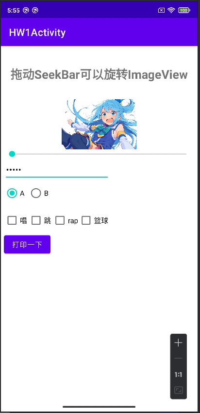
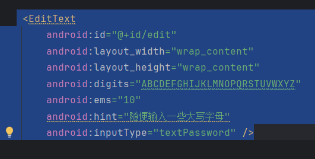
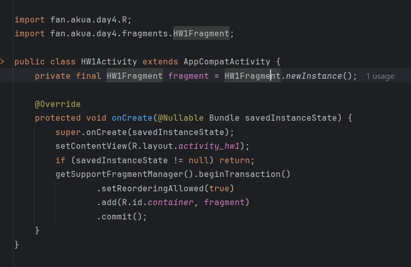
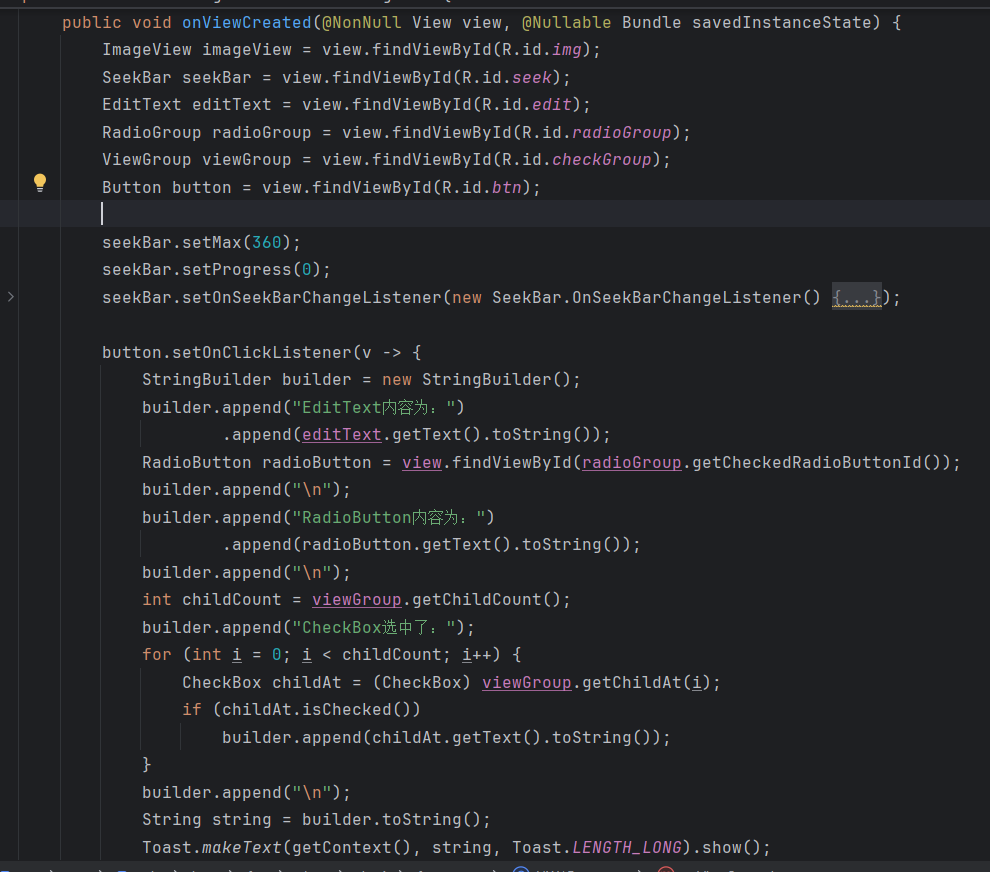

## Day4-HW1

相关的文件如下：

1. [HW1Activity.java](https://partner-gitlab.mioffice.cn/nj-trainingcollege/miclassroom240819/androidgroup4/tanzhehao/homework/-/blob/main/day4/app/src/main/java/fan/akua/day4/activities/HW1Activity.java)
2. [HW1Fragment.java](https://partner-gitlab.mioffice.cn/nj-trainingcollege/miclassroom240819/androidgroup4/tanzhehao/homework/-/blob/main/day4/app/src/main/java/fan/akua/day4/fragments/HW1Fragment.java)
3. [fragment_hw1.xml](https://partner-gitlab.mioffice.cn/nj-trainingcollege/miclassroom240819/androidgroup4/tanzhehao/homework/-/blob/main/day4/app/src/main/res/layout/fragment_hw1.xml)

### 编写布局

比较关键的

### 编写代码

对于宿主Activity

对于Fragment

### 运行效果如下

[视频无法播放请点击我](https://partner-gitlab.mioffice.cn/nj-trainingcollege/miclassroom240819/androidgroup4/tanzhehao/homework/-/tree/main/day4/vx_images/Screen_recording_20240822_175838.mp4)

    <video src="vx_images/Screen_recording_20240822_175838.mp4"></video>

