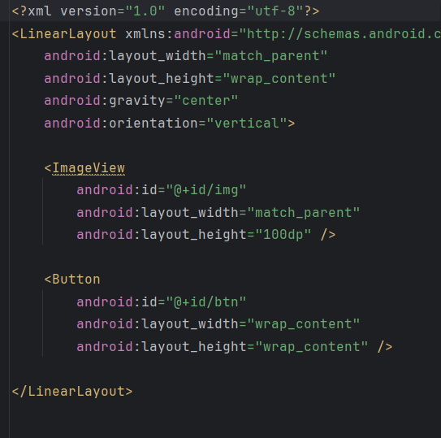
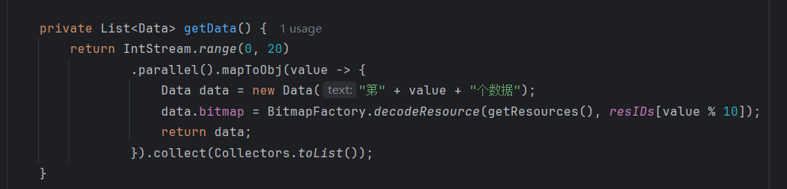
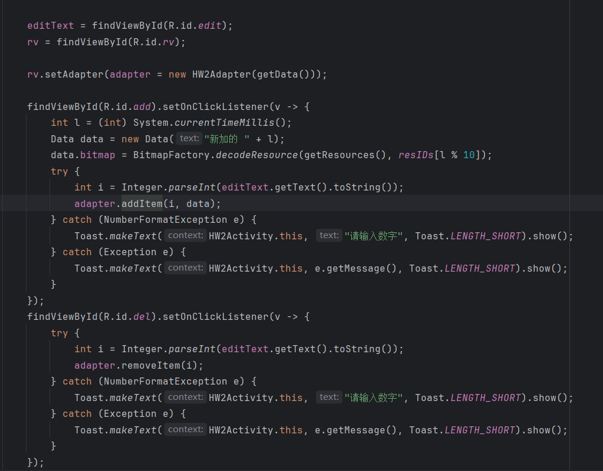
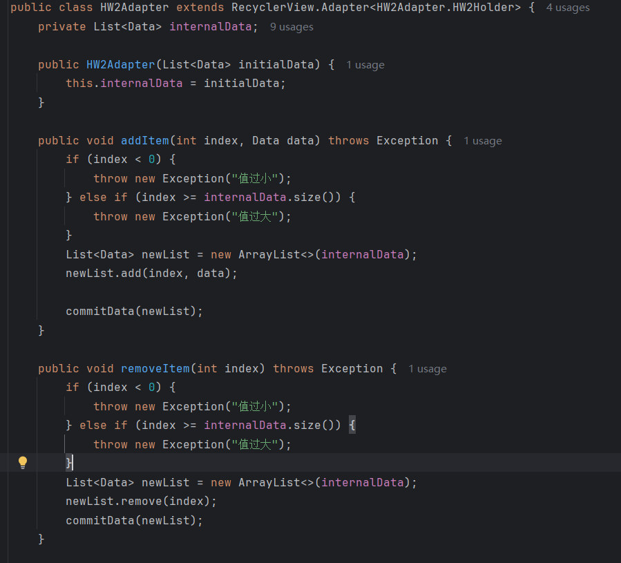
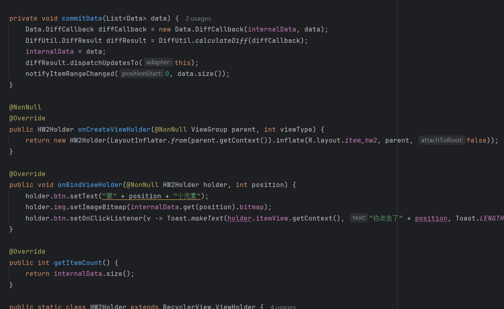

## Day4-HW2 & 3

相关的文件如下：

1. [HW2Activity.java](https://partner-gitlab.mioffice.cn/nj-trainingcollege/miclassroom240819/androidgroup4/tanzhehao/homework/-/blob/main/day4/app/src/main/java/fan/akua/day4/activities/HW2Activity.java)
2. [HW2Adapter.java](https://partner-gitlab.mioffice.cn/nj-trainingcollege/miclassroom240819/androidgroup4/tanzhehao/homework/-/blob/main/day4/app/src/main/java/fan/akua/day4/adapter/HW2Adapter.java)
3. [activity_hw2.xml](https://partner-gitlab.mioffice.cn/nj-trainingcollege/miclassroom240819/androidgroup4/tanzhehao/homework/-/blob/main/day4/app/src/main/res/layout/activity_hw2.xml)
4. [item_hw2.xml](https://partner-gitlab.mioffice.cn/nj-trainingcollege/miclassroom240819/androidgroup4/tanzhehao/homework/-/blob/main/day4/app/src/main/res/layout/item_hw2.xml)

### 编写Item布局

### 编写代码

先编写数据生成的代码

### 编写适配器

### 运行效果如下

[视频无法播放请点击我](https://partner-gitlab.mioffice.cn/nj-trainingcollege/miclassroom240819/androidgroup4/tanzhehao/homework/-/tree/main/day4/vx_images/Screen_recording_20240822_190555.mp4)

    <video src="vx_images/Screen_recording_20240822_190555.mp4"></video>

