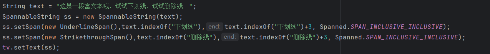
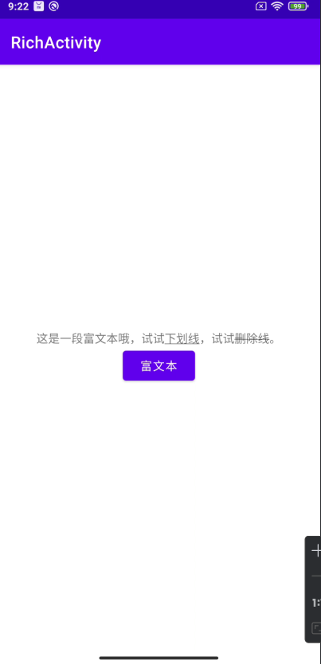

## Day4-Train1

相关的文件如下：
1. [RichActivity.java](https://partner-gitlab.mioffice.cn/nj-trainingcollege/miclassroom240819/androidgroup4/tanzhehao/homework/-/blob/main/day4/app/src/main/java/fan/akua/day4/activities/RichActivity.java)

### 直接编写代码

没啥说的，任务足够简单

需要注意的是Span的flag：

1. **SPAN_EXCLUSIVE_EXCLUSIVE** 前后都不包含
2. **Spanned.SPAN_EXCLUSIVE_INCLUSIVE** 不包含前面 包含后面
3. **Spanned.SPAN_INCLUSIVE_EXCLUSIVE** 包含前面，不包含后面
4. **Spanned.SPAN_INCLUSIVE_INCLUSIVE** 前后都包含

### 运行效果如下

