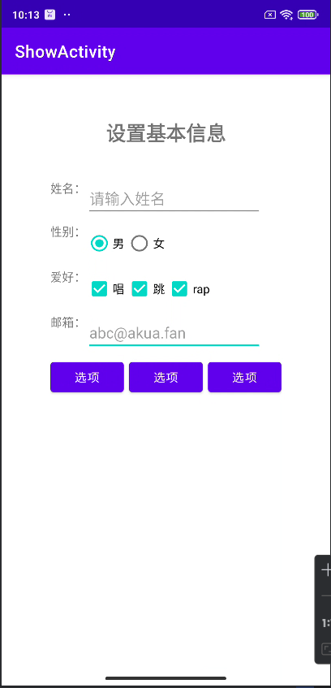

## Day4-Train2

相关的文件如下：
1. [activity_show.xml](https://partner-gitlab.mioffice.cn/nj-trainingcollege/miclassroom240819/androidgroup4/tanzhehao/homework/-/blob/main/day4/app/src/main/res/layout/activity_show.xml)

### 直接编写代码

没啥说的，任务足够简单

```xml
<?xml version="1.0" encoding="utf-8"?>
<LinearLayout xmlns:android="http://schemas.android.com/apk/res/android"
    android:layout_width="match_parent"
    android:layout_height="match_parent"
    android:layout_margin="20dp"
    android:gravity="center"
    android:orientation="vertical">

    <TextView
        android:layout_width="match_parent"
        android:layout_height="100dp"
        android:gravity="center"
        android:text="设置基本信息"
        android:textSize="24sp"
        android:textStyle="bold" />

    <LinearLayout
        android:layout_width="wrap_content"
        android:layout_height="match_parent"
        android:orientation="vertical">

        <LinearLayout
            android:layout_width="match_parent"
            android:layout_height="wrap_content"
            android:layout_marginTop="6dp">

            <TextView
                android:layout_width="wrap_content"
                android:layout_height="match_parent"
                android:text="姓名：" />

            <EditText
                android:layout_width="wrap_content"
                android:layout_height="wrap_content"
                android:ems="10"
                android:hint="请输入姓名" />
        </LinearLayout>

        <LinearLayout
            android:layout_width="match_parent"
            android:layout_height="wrap_content"
            android:layout_marginTop="6dp">

            <TextView
                android:layout_width="wrap_content"
                android:layout_height="match_parent"
                android:text="性别：" />

            <RadioGroup
                android:layout_width="wrap_content"
                android:layout_height="wrap_content"
                android:checkedButton="@id/male"
                android:orientation="horizontal">

                <RadioButton
                    android:id="@+id/male"
                    android:layout_width="wrap_content"
                    android:layout_height="wrap_content"
                    android:text="男" />

                <RadioButton
                    android:id="@+id/female"
                    android:layout_width="wrap_content"
                    android:layout_height="wrap_content"
                    android:text="女" />
            </RadioGroup>
        </LinearLayout>

        <LinearLayout
            android:layout_width="match_parent"
            android:layout_height="wrap_content"
            android:layout_marginTop="6dp">

            <TextView
                android:layout_width="wrap_content"
                android:layout_height="match_parent"
                android:text="爱好：" />

            <CheckBox
                android:layout_width="wrap_content"
                android:layout_height="wrap_content"
                android:text="唱" />

            <CheckBox
                android:layout_width="wrap_content"
                android:layout_height="wrap_content"
                android:text="跳" />

            <CheckBox
                android:layout_width="wrap_content"
                android:layout_height="wrap_content"
                android:text="rap" />
        </LinearLayout>

        <LinearLayout
            android:layout_width="match_parent"
            android:layout_height="wrap_content"
            android:layout_marginTop="6dp">

            <TextView
                android:layout_width="wrap_content"
                android:layout_height="match_parent"
                android:text="邮箱：" />

            <EditText
                android:layout_width="wrap_content"
                android:layout_height="wrap_content"
                android:ems="10"
                android:hint="abc@akua.fan"
                android:inputType="textEmailAddress" />
        </LinearLayout>

        <LinearLayout
            android:layout_width="match_parent"
            android:layout_height="wrap_content"
            android:layout_marginTop="6dp">

            <Button
                android:layout_width="wrap_content"
                android:layout_height="wrap_content"
                android:text="选项" />

            <Button
                android:layout_width="wrap_content"
                android:layout_height="wrap_content"
                android:layout_marginStart="6dp"
                android:layout_marginEnd="6dp"
                android:text="选项" />

            <Button
                android:layout_width="wrap_content"
                android:layout_height="wrap_content"
                android:text="选项" />
        </LinearLayout>
    </LinearLayout>

</LinearLayout>
```

### 运行效果如下


