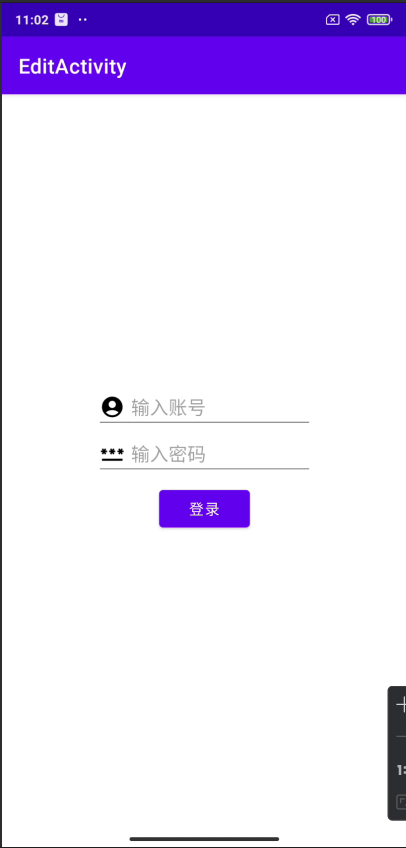
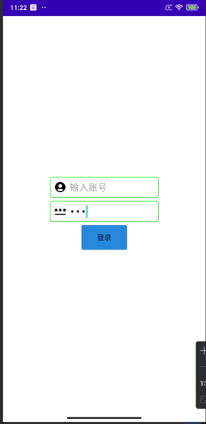

## Day4-Train3

相关的文件如下：
1. [activity_edittext.xml](https://partner-gitlab.mioffice.cn/nj-trainingcollege/miclassroom240819/androidgroup4/tanzhehao/homework/-/blob/main/day4/app/src/main/res/layout/activity_edittext.xml)

### 直接编写代码

没啥说的，任务足够简单

```xml
<?xml version="1.0" encoding="utf-8"?>
<LinearLayout xmlns:android="http://schemas.android.com/apk/res/android"
    android:layout_width="match_parent"
    android:layout_height="match_parent"
    android:fitsSystemWindows="true"
    android:gravity="center"
    android:orientation="vertical">

    <LinearLayout
        android:layout_width="wrap_content"
        android:layout_height="wrap_content"
        android:gravity="center"
        android:orientation="vertical">

        <EditText
            android:layout_width="wrap_content"
            android:layout_height="wrap_content"
            android:drawableStart="@drawable/baseline_account_circle_24"
            android:drawablePadding="6dp"
            android:ems="10"
            android:hint="输入账号"
            android:imeOptions="actionNext"
            android:inputType="text" />

        <EditText
            android:layout_width="wrap_content"
            android:layout_height="wrap_content"
            android:drawableStart="@drawable/baseline_password_24"
            android:drawablePadding="6dp"
            android:ems="10"
            android:hint="输入密码"
            android:imeOptions="actionDone"
            android:inputType="numberPassword" />
    </LinearLayout>

    <Button
        android:layout_width="wrap_content"
        android:layout_height="wrap_content"
        android:layout_margin="6dp"
        android:text="登录" />


</LinearLayout>
```

### 运行效果如下



### 进阶

美化一下

