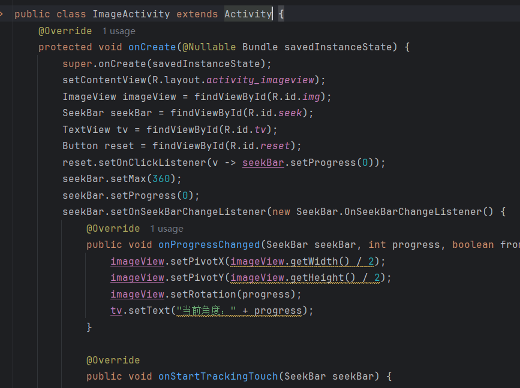

## Day4-Train4

相关的文件如下：
1. [ImageActivity.java](https://partner-gitlab.mioffice.cn/nj-trainingcollege/miclassroom240819/androidgroup4/tanzhehao/homework/-/blob/main/day4/app/src/main/java/fan/akua/day4/activities/ImageActivity.java)

### 编写xml

没啥说的，任务足够简单

```xml
<?xml version="1.0" encoding="utf-8"?>
<LinearLayout xmlns:android="http://schemas.android.com/apk/res/android"
    android:layout_width="match_parent"
    android:layout_height="match_parent"
    android:gravity="center"
    android:orientation="vertical"
    android:padding="12dp">

    <ImageView
        android:id="@+id/img"
        android:layout_width="match_parent"
        android:layout_height="200dp"
        android:src="@drawable/akua" />

    <TextView
        android:id="@+id/tv"
        android:textStyle="bold"
        android:layout_width="wrap_content"
        android:layout_height="wrap_content"
        android:text="当前角度：0" />

    <Button
        android:id="@+id/reset"
        android:background="@drawable/border_bg"
        android:layout_width="wrap_content"
        android:layout_height="wrap_content"
        android:text="重置" />

    <ProgressBar
        style="?android:attr/progressBarStyleHorizontal"
        android:layout_width="match_parent"
        android:layout_height="wrap_content"
        android:indeterminate="true" />

    <ProgressBar
        style="@style/Widget.AppCompat.ProgressBar"
        android:layout_width="match_parent"
        android:layout_height="wrap_content"
        android:indeterminate="true" />

    <SeekBar
        android:id="@+id/seek"
        android:layout_width="match_parent"
        android:layout_height="wrap_content" />

</LinearLayout>
```

### 编写Activity



### 运行效果如下

[视频无法播放请点击我](https://partner-gitlab.mioffice.cn/nj-trainingcollege/miclassroom240819/androidgroup4/tanzhehao/homework/-/tree/main/day4/vx_images/Screen_recording_20240822_142459.mp4)

<div>
    <video src="vx_images/Screen_recording_20240822_142459.mp4"></video>
</div>

