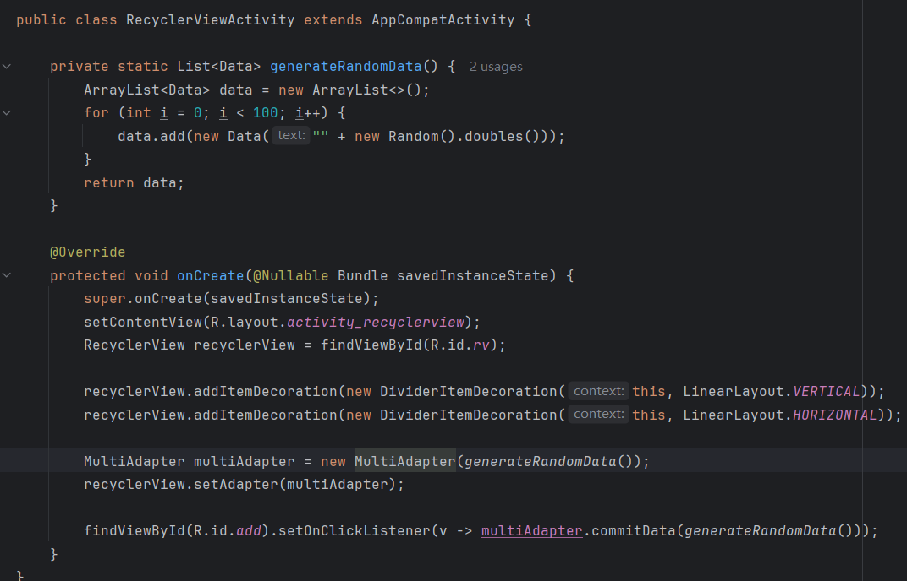
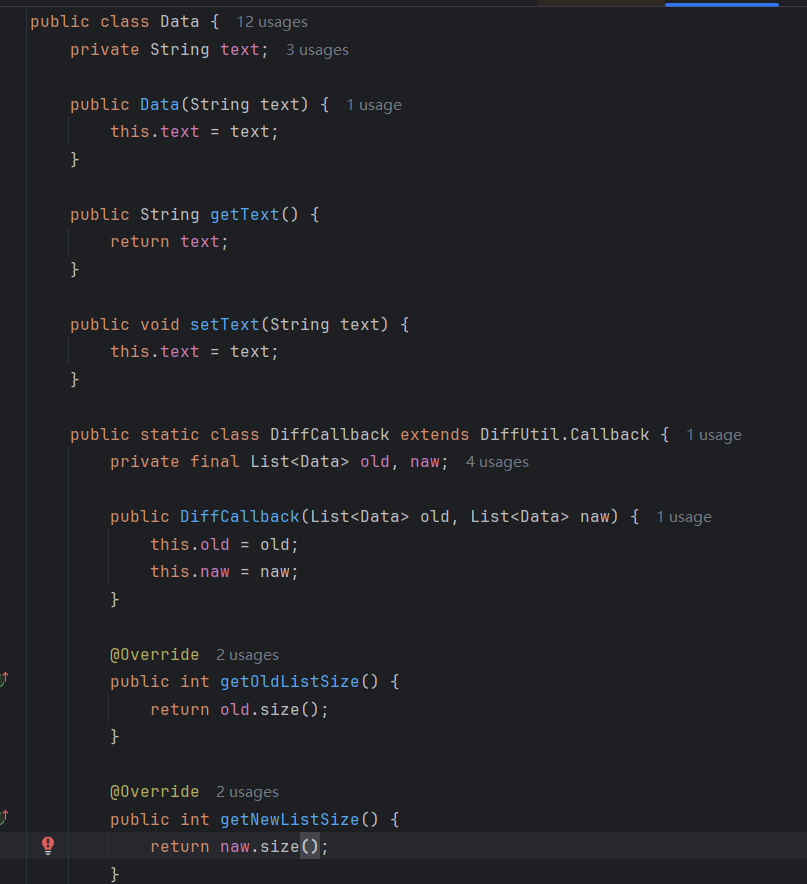
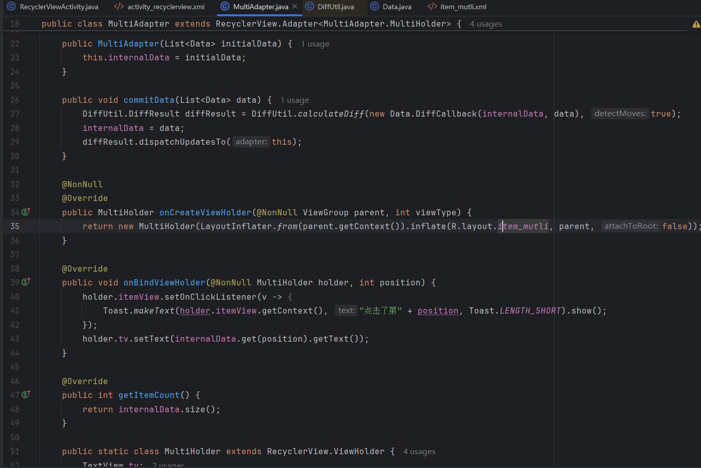

## Day4-Train5

相关的文件如下：
1. [RecyclerViewActivity.java](https://partner-gitlab.mioffice.cn/nj-trainingcollege/miclassroom240819/androidgroup4/tanzhehao/homework/-/blob/main/day4/app/src/main/java/fan/akua/day4/activities/RecyclerViewActivity.java)
2. [MultiAdapter.java](https://partner-gitlab.mioffice.cn/nj-trainingcollege/miclassroom240819/androidgroup4/tanzhehao/homework/-/blob/main/day4/app/src/main/java/fan/akua/day4/adapter/MultiAdapter.java)
3. [Data.java](https://partner-gitlab.mioffice.cn/nj-trainingcollege/miclassroom240819/androidgroup4/tanzhehao/homework/-/blob/main/day4/app/src/main/java/fan/akua/day4/bean/Data.java)

### 编写xml

注意，我直接在xml中声明了layoutManager

```xml
<?xml version="1.0" encoding="utf-8"?>
<LinearLayout xmlns:android="http://schemas.android.com/apk/res/android"
    android:layout_width="match_parent"
    android:orientation="vertical"
    android:layout_height="match_parent">

    <LinearLayout
        android:layout_width="match_parent"
        android:layout_height="wrap_content">

        <Button
            android:id="@+id/add"
            android:layout_width="wrap_content"
            android:layout_height="wrap_content"
            android:text="随机生成" />
    </LinearLayout>

    <androidx.recyclerview.widget.RecyclerView xmlns:app="http://schemas.android.com/apk/res-auto"
        android:id="@+id/rv"
        android:layout_width="match_parent"
        android:layout_height="match_parent"
        android:orientation="vertical"
        app:layoutManager="androidx.recyclerview.widget.StaggeredGridLayoutManager"
        app:spanCount="2" />

</LinearLayout>
```

### 编写Activity



### 编写Adapter

首先定义Bean吧，顺便实现一下DiffCallBack



接下来是Adapter



三两行代码，没什么难点

### 运行效果如下

[视频无法播放请点击我](https://partner-gitlab.mioffice.cn/nj-trainingcollege/miclassroom240819/androidgroup4/tanzhehao/homework/-/tree/main/day4/vx_images/Screen_recording_20240822_152611.mp4)

<div>
    <video src="vx_images/Screen_recording_20240822_152611.mp4"></video>
</div>

