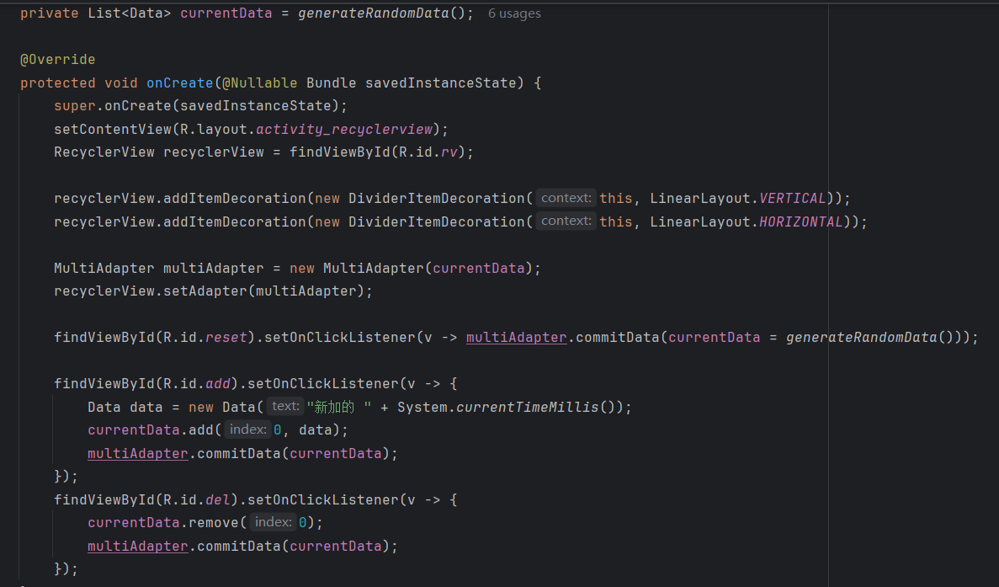
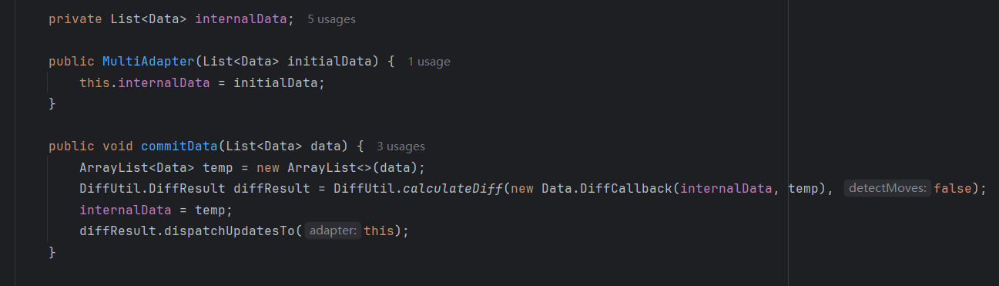

## Day4-Train6

相关的文件如下：
1. [RecyclerViewActivity.java](https://partner-gitlab.mioffice.cn/nj-trainingcollege/miclassroom240819/androidgroup4/tanzhehao/homework/-/blob/main/day4/app/src/main/java/fan/akua/day4/activities/RecyclerViewActivity.java)
2. [MultiAdapter.java](https://partner-gitlab.mioffice.cn/nj-trainingcollege/miclassroom240819/androidgroup4/tanzhehao/homework/-/blob/main/day4/app/src/main/java/fan/akua/day4/adapter/MultiAdapter.java)
3. [Data.java](https://partner-gitlab.mioffice.cn/nj-trainingcollege/miclassroom240819/androidgroup4/tanzhehao/homework/-/blob/main/day4/app/src/main/java/fan/akua/day4/bean/Data.java)

### 编写点击事件

得益于刚才使用的DiffUtil，可以很轻松的实现

再改一下Adapter即可

### 运行效果如下

[视频无法播放请点击我](https://partner-gitlab.mioffice.cn/nj-trainingcollege/miclassroom240819/androidgroup4/tanzhehao/homework/-/tree/main/day4/vx_images/Screen_recording_20240822_160826.mp4)

    <video src="vx_images/Screen_recording_20240822_160826.mp4"></video>

