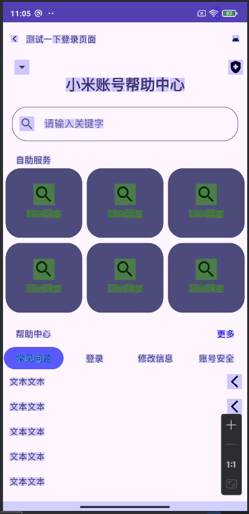

## Day5-HW1

相关的文件如下：

1. [activity_hw1.xml](app/src/main/res/layout/activity_hw1.xml)
2. [item_service1.xml](app/src/main/res/layout/item_service1.xml)
3. [item_service2.xml](app/src/main/res/layout/item_service2.xml)

今日下午有急事，晚上10点才回学校，因此作业完成的较为匆忙。

### 编写布局

大体结构就是约束布局，在“自助服务”的子选项里面，使用inlude引入下面的gird布局（并非gird，我这里是用约束布局实现的网格效果）。

另外，帮助中心的item，全部用include引入同样的布局

activity_hw1.xml

```xml
<?xml version="1.0" encoding="utf-8"?>
<androidx.constraintlayout.widget.ConstraintLayout xmlns:android="http://schemas.android.com/apk/res/android"
    xmlns:app="http://schemas.android.com/apk/res-auto"
    xmlns:tools="http://schemas.android.com/tools"
    android:layout_width="match_parent"
    android:layout_height="match_parent">

    <ImageView
        android:id="@+id/img"
        android:layout_width="24dp"
        android:layout_height="24dp"
        android:layout_margin="6dp"
        android:padding="6dp"
        android:src="@drawable/baseline_arrow_back_ios_new_24"
        app:layout_constraintBottom_toTopOf="@id/guideline3"
        app:layout_constraintStart_toStartOf="parent"
        app:layout_constraintTop_toTopOf="parent" />

    <TextView
        android:id="@+id/textView4"
        android:layout_width="wrap_content"
        android:layout_height="wrap_content"
        android:layout_marginStart="6dp"
        android:text="测试一下登录页面"
        app:layout_constraintBottom_toTopOf="@id/guideline3"
        app:layout_constraintStart_toEndOf="@id/img"
        app:layout_constraintTop_toTopOf="parent" />

    <ImageView
        android:id="@+id/imageView2"
        android:layout_width="24dp"
        android:layout_height="24dp"
        android:layout_margin="6dp"
        android:padding="6dp"
        android:src="@drawable/ic_android_black_24dp"
        app:layout_constraintBottom_toTopOf="@id/guideline3"
        app:layout_constraintEnd_toEndOf="parent"
        app:layout_constraintTop_toTopOf="parent" />

    <androidx.constraintlayout.widget.Guideline
        android:id="@+id/guideline3"
        android:layout_width="wrap_content"
        android:layout_height="wrap_content"
        android:orientation="horizontal"
        app:layout_constraintGuide_percent="0.07" />

    <Spinner
        android:id="@+id/spinner"
        android:layout_width="wrap_content"
        android:layout_height="wrap_content"
        android:layout_margin="6dp"
        app:layout_constraintStart_toStartOf="parent"
        app:layout_constraintTop_toBottomOf="@id/guideline3" />

    <ImageView
        android:layout_width="24dp"
        android:layout_height="24dp"
        android:layout_margin="6dp"
        android:src="@drawable/baseline_health_and_safety_24"
        app:layout_constraintEnd_toEndOf="parent"
        app:layout_constraintTop_toBottomOf="@id/guideline3" />

    <TextView
        android:id="@+id/title"
        android:layout_width="wrap_content"
        android:layout_height="wrap_content"
        android:text="小米账号帮助中心"
        android:textSize="24sp"
        android:textStyle="bold"
        app:layout_constraintEnd_toEndOf="parent"
        app:layout_constraintStart_toStartOf="parent"
        app:layout_constraintTop_toBottomOf="@id/spinner" />

    <com.google.android.material.textfield.TextInputLayout
        android:id="@+id/textInputLayout"
        style="@style/Widget.MaterialComponents.TextInputLayout.OutlinedBox"
        android:layout_width="match_parent"
        android:layout_height="wrap_content"
        android:layout_margin="14dp"
        android:hint="@string/input_keywords"
        app:boxCornerRadiusBottomEnd="24dp"
        app:boxCornerRadiusBottomStart="24dp"
        app:boxCornerRadiusTopEnd="24dp"
        app:boxCornerRadiusTopStart="24dp"
        app:boxStrokeColor="#00ff00"
        app:hintEnabled="true"
        app:layout_constraintEnd_toEndOf="parent"
        app:layout_constraintStart_toStartOf="parent"
        app:layout_constraintTop_toBottomOf="@id/title"
        app:startIconDrawable="@drawable/baseline_search_24">

        <com.google.android.material.textfield.TextInputEditText
            android:layout_width="match_parent"
            android:layout_height="wrap_content"
            android:inputType="textMultiLine" />

    </com.google.android.material.textfield.TextInputLayout>

    <TextView
        android:id="@+id/subTitle1"
        android:layout_width="wrap_content"
        android:layout_height="wrap_content"
        android:layout_margin="20dp"
        android:text="自助服务"
        app:layout_constraintStart_toStartOf="parent"
        app:layout_constraintTop_toBottomOf="@id/textInputLayout" />

    <LinearLayout
        android:id="@+id/list1"
        android:layout_width="0dp"
        android:layout_height="wrap_content"
        app:layout_constraintEnd_toEndOf="parent"
        app:layout_constraintStart_toStartOf="parent"
        app:layout_constraintTop_toBottomOf="@id/subTitle1">

        <include layout="@layout/item_service1" />
    </LinearLayout>

    <TextView
        android:id="@+id/subTitle2"
        android:layout_width="wrap_content"
        android:layout_height="wrap_content"
        android:layout_margin="20dp"
        android:text="帮助中心"
        app:layout_constraintStart_toStartOf="parent"
        app:layout_constraintTop_toBottomOf="@id/list1" />

    <TextView
        android:layout_width="wrap_content"
        android:layout_height="wrap_content"
        android:layout_margin="20dp"
        android:text="更多"
        android:textColor="#0000ff"
        app:layout_constraintEnd_toEndOf="parent"
        app:layout_constraintTop_toBottomOf="@id/list1" />

    <TextView
        android:id="@+id/button2"
        android:layout_width="0dp"
        android:layout_height="wrap_content"
        android:layout_marginStart="1dp"
        android:layout_marginTop="12dp"
        android:layout_marginEnd="1dp"
        android:background="@drawable/blue_rounded_background"
        android:gravity="center"
        android:padding="8dp"
        android:text="常见问题"
        android:textColor="#0000ff"
        app:layout_constraintEnd_toStartOf="@+id/button"
        app:layout_constraintHorizontal_bias="0.5"
        app:layout_constraintStart_toStartOf="parent"
        app:layout_constraintTop_toBottomOf="@id/subTitle2" />

    <TextView
        android:id="@+id/button"
        android:layout_width="0dp"
        android:layout_height="wrap_content"
        android:layout_margin="1dp"
        android:gravity="center"
        android:text="登录"
        app:layout_constraintBottom_toBottomOf="@+id/button2"
        app:layout_constraintEnd_toStartOf="@+id/button3"
        app:layout_constraintHorizontal_bias="0.5"
        app:layout_constraintStart_toEndOf="@+id/button2"
        app:layout_constraintTop_toTopOf="@+id/button2" />

    <TextView
        android:id="@+id/button3"
        android:layout_width="0dp"
        android:layout_height="wrap_content"
        android:layout_margin="1dp"
        android:gravity="center"
        android:text="修改信息"
        app:layout_constraintBottom_toBottomOf="@+id/button"
        app:layout_constraintEnd_toStartOf="@+id/button4"
        app:layout_constraintHorizontal_bias="0.5"
        app:layout_constraintStart_toEndOf="@+id/button"
        app:layout_constraintTop_toTopOf="@+id/button" />

    <TextView
        android:id="@+id/button4"
        android:layout_width="0dp"
        android:layout_height="wrap_content"
        android:layout_margin="1dp"
        android:gravity="center"
        android:text="账号安全"
        app:layout_constraintBottom_toBottomOf="@+id/button3"
        app:layout_constraintEnd_toEndOf="parent"
        app:layout_constraintHorizontal_bias="0.5"
        app:layout_constraintStart_toEndOf="@+id/button3"
        app:layout_constraintTop_toTopOf="@+id/button3" />

    <LinearLayout
        android:layout_width="0dp"
        android:layout_height="0dp"
        android:orientation="vertical"
        app:layout_constraintBottom_toBottomOf="parent"
        app:layout_constraintEnd_toEndOf="parent"
        app:layout_constraintStart_toStartOf="parent"
        app:layout_constraintTop_toBottomOf="@id/button2">

        <include layout="@layout/item_service2" />

        <include layout="@layout/item_service2" />

        <include layout="@layout/item_service2" />

        <include layout="@layout/item_service2" />

        <include layout="@layout/item_service2" />
    </LinearLayout>

</androidx.constraintlayout.widget.ConstraintLayout>
```

item_service1.xml

这个是“自助服务”部分的布局

```xml
<?xml version="1.0" encoding="utf-8"?>
<androidx.constraintlayout.widget.ConstraintLayout xmlns:android="http://schemas.android.com/apk/res/android"
    xmlns:app="http://schemas.android.com/apk/res-auto"
    android:layout_width="match_parent"
    android:layout_height="240dp">

    <LinearLayout
        android:id="@+id/LinearLayout1"
        android:layout_width="0dp"
        android:layout_height="0dp"
        android:layout_margin="4dp"
        android:background="@drawable/rounded_background"
        android:gravity="center"
        android:orientation="vertical"
        app:layout_constraintBottom_toTopOf="@+id/LinearLayout4"
        app:layout_constraintEnd_toStartOf="@+id/LinearLayout2"
        app:layout_constraintStart_toStartOf="parent"
        app:layout_constraintTop_toTopOf="parent">

        <ImageView
            android:layout_width="34dp"
            android:layout_height="34dp"
            android:scaleType="fitXY"
            android:src="@drawable/baseline_search_24" />

        <TextView
            android:layout_width="wrap_content"
            android:layout_height="wrap_content"
            android:layout_margin="4dp"
            android:text="重置密码" />

    </LinearLayout>

    <LinearLayout
        android:id="@+id/LinearLayout2"
        android:layout_width="0dp"
        android:layout_height="0dp"
        android:layout_margin="4dp"
        android:background="@drawable/rounded_background"
        android:gravity="center"
        android:orientation="vertical"
        app:layout_constraintBottom_toTopOf="@+id/LinearLayout5"
        app:layout_constraintEnd_toStartOf="@+id/LinearLayout3"
        app:layout_constraintStart_toEndOf="@+id/LinearLayout1"
        app:layout_constraintTop_toTopOf="parent">

        <ImageView
            android:layout_width="34dp"
            android:layout_height="34dp"
            android:scaleType="fitXY"
            android:src="@drawable/baseline_search_24" />

        <TextView
            android:layout_width="wrap_content"
            android:layout_height="wrap_content"
            android:layout_margin="4dp"
            android:text="重置密码" />

    </LinearLayout>

    <LinearLayout
        android:id="@+id/LinearLayout3"
        android:layout_width="0dp"
        android:layout_height="0dp"
        android:layout_margin="4dp"
        android:background="@drawable/rounded_background"
        android:gravity="center"
        android:orientation="vertical"
        app:layout_constraintBottom_toTopOf="@+id/LinearLayout6"
        app:layout_constraintEnd_toEndOf="parent"
        app:layout_constraintStart_toEndOf="@+id/LinearLayout2"
        app:layout_constraintTop_toTopOf="parent">

        <ImageView
            android:layout_width="34dp"
            android:layout_height="34dp"
            android:scaleType="fitXY"
            android:src="@drawable/baseline_search_24" />

        <TextView
            android:layout_width="wrap_content"
            android:layout_height="wrap_content"
            android:layout_margin="4dp"
            android:text="重置密码" />

    </LinearLayout>

    <LinearLayout
        android:id="@+id/LinearLayout4"
        android:layout_width="0dp"
        android:layout_height="0dp"
        android:layout_margin="4dp"
        android:background="@drawable/rounded_background"
        android:gravity="center"
        android:orientation="vertical"
        app:layout_constraintBottom_toBottomOf="parent"
        app:layout_constraintEnd_toStartOf="@+id/LinearLayout5"
        app:layout_constraintStart_toStartOf="parent"
        app:layout_constraintTop_toBottomOf="@+id/LinearLayout1">

        <ImageView
            android:layout_width="34dp"
            android:layout_height="34dp"
            android:scaleType="fitXY"
            android:src="@drawable/baseline_search_24" />

        <TextView
            android:layout_width="wrap_content"
            android:layout_height="wrap_content"
            android:layout_margin="4dp"
            android:text="重置密码" />

    </LinearLayout>

    <LinearLayout
        android:id="@+id/LinearLayout5"
        android:layout_width="0dp"
        android:layout_height="0dp"
        android:layout_margin="4dp"
        android:background="@drawable/rounded_background"
        android:gravity="center"
        android:orientation="vertical"
        app:layout_constraintBottom_toBottomOf="parent"
        app:layout_constraintEnd_toStartOf="@+id/LinearLayout6"
        app:layout_constraintStart_toEndOf="@+id/LinearLayout4"
        app:layout_constraintTop_toBottomOf="@+id/LinearLayout2">

        <ImageView
            android:layout_width="34dp"
            android:layout_height="34dp"
            android:scaleType="fitXY"
            android:src="@drawable/baseline_search_24" />

        <TextView
            android:layout_width="wrap_content"
            android:layout_height="wrap_content"
            android:layout_margin="4dp"
            android:text="重置密码" />

    </LinearLayout>

    <LinearLayout
        android:id="@+id/LinearLayout6"
        android:layout_width="0dp"
        android:layout_height="0dp"
        android:layout_margin="4dp"
        android:background="@drawable/rounded_background"
        android:gravity="center"
        android:orientation="vertical"
        app:layout_constraintBottom_toBottomOf="parent"
        app:layout_constraintEnd_toEndOf="parent"
        app:layout_constraintStart_toEndOf="@+id/LinearLayout5"
        app:layout_constraintTop_toBottomOf="@+id/LinearLayout3">

        <ImageView
            android:layout_width="34dp"
            android:layout_height="34dp"
            android:scaleType="fitXY"
            android:src="@drawable/baseline_search_24" />

        <TextView
            android:layout_width="wrap_content"
            android:layout_height="wrap_content"
            android:layout_margin="4dp"
            android:text="重置密码" />

    </LinearLayout>

</androidx.constraintlayout.widget.ConstraintLayout>
```

item_service2.xml

这个是帮助中心的item

```xml
<?xml version="1.0" encoding="utf-8"?>
<RelativeLayout xmlns:android="http://schemas.android.com/apk/res/android"
    android:layout_width="match_parent"
    android:layout_height="wrap_content"
    android:padding="4dp">

    <ImageView
        android:visibility="gone"
        android:id="@+id/img"
        android:layout_width="24dp"
        android:layout_height="24dp"
        android:layout_alignParentStart="true"
        android:layout_centerVertical="true"
        android:layout_margin="4dp"
        android:src="@drawable/ic_android_black_24dp" />

    <TextView
        android:layout_marginStart="6dp"
        android:layout_width="wrap_content"
        android:layout_height="wrap_content"
        android:layout_centerVertical="true"
        android:layout_toEndOf="@id/img"
        android:text="文本文本" />

    <ImageView
        android:layout_margin="4dp"
        android:layout_width="24dp"
        android:layout_height="24dp"
        android:layout_alignParentEnd="true"
        android:layout_centerVertical="true"
        android:src="@drawable/baseline_arrow_back_ios_new_24" />


</RelativeLayout>
```

### 运行效果如下

已打开了过度绘制。

