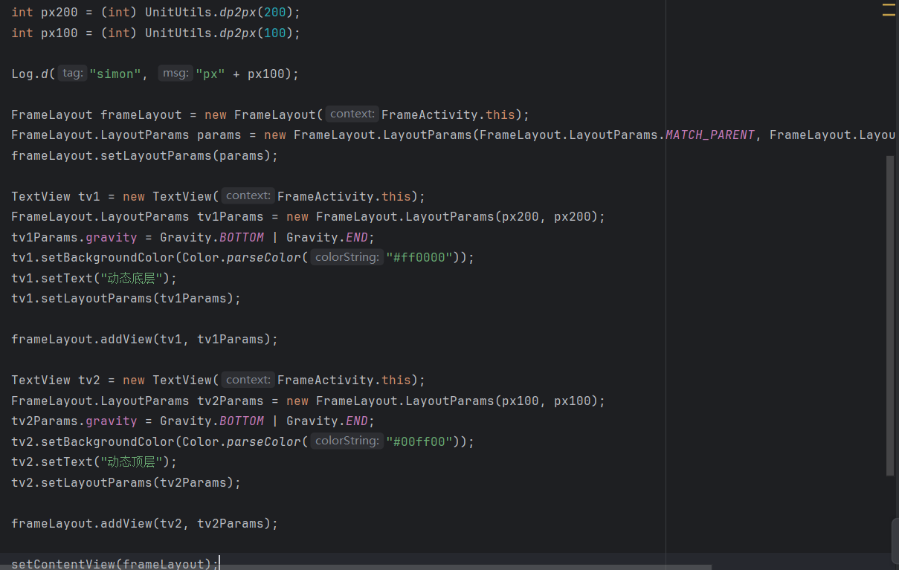
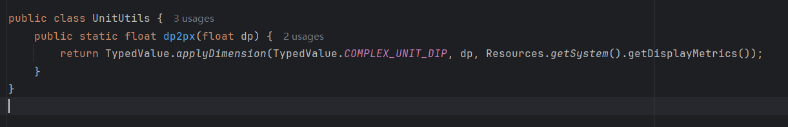
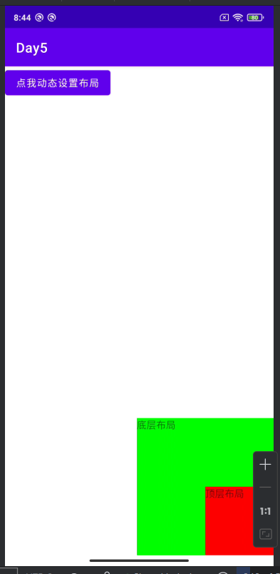
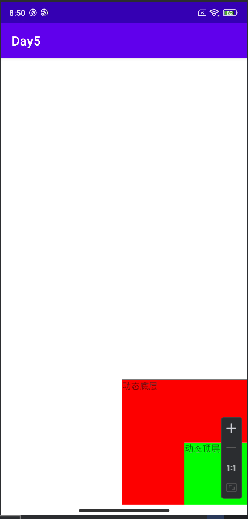

## Day5-Train1

相关的文件如下：
1. [FrameActivity.java](app/src/main/java/fan/akua/day5/activities/FrameActivity.java)
2. [activity_frame.xml](app/src/main/res/layout/activity_frame.xml)

### 编写布局

```xml
<?xml version="1.0" encoding="utf-8"?>
<FrameLayout xmlns:android="http://schemas.android.com/apk/res/android"
    android:layout_width="match_parent"
    android:layout_height="match_parent">

    <TextView
        android:layout_width="200dp"
        android:layout_height="200dp"
        android:layout_gravity="bottom|end"
        android:background="#00ff00"
        android:text="底层布局" />

    <TextView
        android:layout_width="100dp"
        android:layout_height="100dp"
        android:layout_gravity="bottom|end"
        android:background="#ff0000"
        android:text="顶层布局" />

    <Button
        android:id="@+id/dynamic"
        android:layout_width="wrap_content"
        android:layout_height="wrap_content"
        android:text="点我动态设置布局" />
</FrameLayout>
```

### 编写动态布局



其中工具类为




### 运行效果如下

静态布局



动态布局

