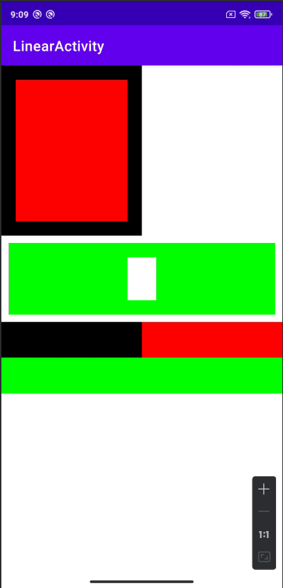

## Day5-Train2

相关的文件如下：
1. [LinearActivity.java](app/src/main/java/fan/akua/day5/activities/LinearActivity.java)
2. [activity_linear.xml](app/src/main/res/layout/activity_linear.xml)

### 编写布局

```xml
<?xml version="1.0" encoding="utf-8"?>
<LinearLayout xmlns:android="http://schemas.android.com/apk/res/android"
    android:layout_width="match_parent"
    android:layout_height="match_parent"
    android:orientation="vertical">

    <LinearLayout
        android:layout_width="match_parent"
        android:layout_height="0dp"
        android:layout_weight="1">

        <FrameLayout
            android:layout_width="0dp"
            android:layout_height="match_parent"
            android:layout_weight="1"
            android:background="@color/black"
            android:padding="20dp">

            <View
                android:layout_width="match_parent"
                android:layout_height="match_parent"
                android:background="#ff0000" />

        </FrameLayout>

        <Space
            android:layout_width="0dp"
            android:layout_height="match_parent"
            android:layout_weight="1" />
    </LinearLayout>

    <LinearLayout
        android:layout_width="match_parent"
        android:layout_height="0dp"
        android:layout_weight="2"
        android:orientation="vertical">

        <FrameLayout
            android:layout_margin="10dp"
            android:layout_width="match_parent"
            android:layout_height="100dp"
            android:background="#00ff00"
            android:padding="20dp">

            <View
                android:layout_width="40dp"
                android:layout_height="match_parent"
                android:layout_gravity="center"
                android:background="@color/white" />
        </FrameLayout>

        <LinearLayout
            android:layout_width="match_parent"
            android:layout_height="100dp"
            android:orientation="vertical">

            <LinearLayout
                android:layout_width="match_parent"
                android:layout_height="0dp"
                android:layout_weight="1">

                <View
                    android:layout_width="0dp"
                    android:layout_height="match_parent"
                    android:layout_weight="1"
                    android:background="@color/black" />

                <View
                    android:layout_width="0dp"
                    android:layout_height="match_parent"
                    android:layout_weight="1"
                    android:background="#ff0000" />
            </LinearLayout>

            <View
                android:layout_width="match_parent"
                android:layout_height="0dp"
                android:layout_weight="1"
                android:background="#00ff00" />
        </LinearLayout>
    </LinearLayout>


</LinearLayout>
```

### 编写动态布局

这个就不做了，这玩意没啥技术含量，纯浪费时间。

值得一提的是，这个布局用X2J居然没法转换，FrameLayout直接给我吞了。

### 运行效果如下

静态布局


