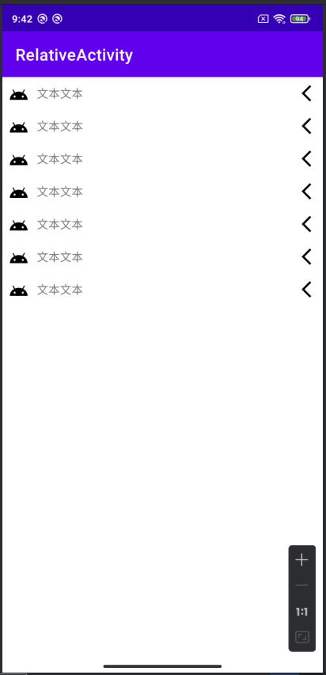

## Day5-Train3

相关的文件如下：
1. [LinearActivity.java](app/src/main/java/fan/akua/day5/activities/LinearActivity.java)
2. [activity_relative.xml](app/src/main/res/layout/activity_relative.xml)
3. [item_setting.xml](app/src/main/res/layout/item_setting.xml)

### 编写布局

简单点，直接include

```xml
<?xml version="1.0" encoding="utf-8"?>
<LinearLayout xmlns:android="http://schemas.android.com/apk/res/android"
    android:layout_width="match_parent"
    android:orientation="vertical"
    android:layout_height="match_parent">

    <include layout="@layout/item_setting" />

    <include layout="@layout/item_setting" />

    <include layout="@layout/item_setting" />

    <include layout="@layout/item_setting" />

    <include layout="@layout/item_setting" />

    <include layout="@layout/item_setting" />

    <include layout="@layout/item_setting" />

</LinearLayout>

```

对于每个item

```xml
<?xml version="1.0" encoding="utf-8"?>
<RelativeLayout xmlns:android="http://schemas.android.com/apk/res/android"
    android:layout_width="match_parent"
    android:layout_height="wrap_content"
    android:padding="4dp">

    <ImageView
        android:id="@+id/img"
        android:layout_width="24dp"
        android:layout_height="24dp"
        android:layout_alignParentStart="true"
        android:layout_centerVertical="true"
        android:layout_margin="4dp"
        android:src="@drawable/ic_android_black_24dp" />

    <TextView
        android:layout_marginStart="6dp"
        android:layout_width="wrap_content"
        android:layout_height="wrap_content"
        android:layout_centerVertical="true"
        android:layout_toEndOf="@id/img"
        android:text="文本文本" />

    <ImageView
        android:layout_margin="4dp"
        android:layout_width="24dp"
        android:layout_height="24dp"
        android:layout_alignParentEnd="true"
        android:layout_centerVertical="true"
        android:src="@drawable/baseline_arrow_back_ios_new_24" />


</RelativeLayout>
```

### 运行效果如下

