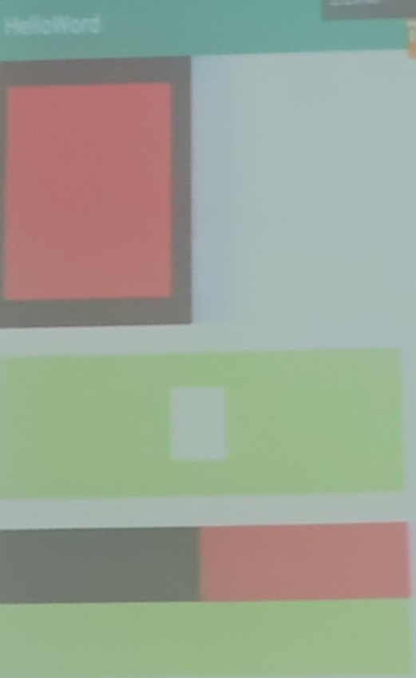

    

        <strong>nj-trainingcollege/miclassroom240819/androidgroup4/tanzhehao</strong>
         
    

    今日课程
      
    
<strong>课堂练习</strong>

     

1. [x] 实现一个布局，使其两个文本框层叠并显示在页面底部。（扩展：代码实现布局效果）
2. [x] 使用LinearLayout和FrameLayout实现 [附图1] 的页面。（扩展：代码实现布局效果）
3. [x] 使用RelativeLayout实现设置页面的布局。
4. [x] 用ConstraintLayout实现 [附图2] 的页面。

     
    
<strong>今日作业</strong>

     

1. [x] 暂无

    <a href="https://partner-gitlab.mioffice.cn/nj-trainingcollege/miclassroom240819/androidgroup4/tanzhehao/homework/-/raw/main/day4/app/release/app-release.apk?inline=false">Download Release App</a>
     

## 附图

附图1

附图2

## 课堂练习报告

|                         |                         |
| ----------------------- | ----------------------- |
| [任务1](Day5-Train1.md) | [任务2](Day5-Train2.md) |
| [任务3](Day5-Train3.md) | [任务4](Day5-Train4.md) |

## 今日作业报告

|      |      |
| ---- | ---- |
| 暂无 | 暂无 |
