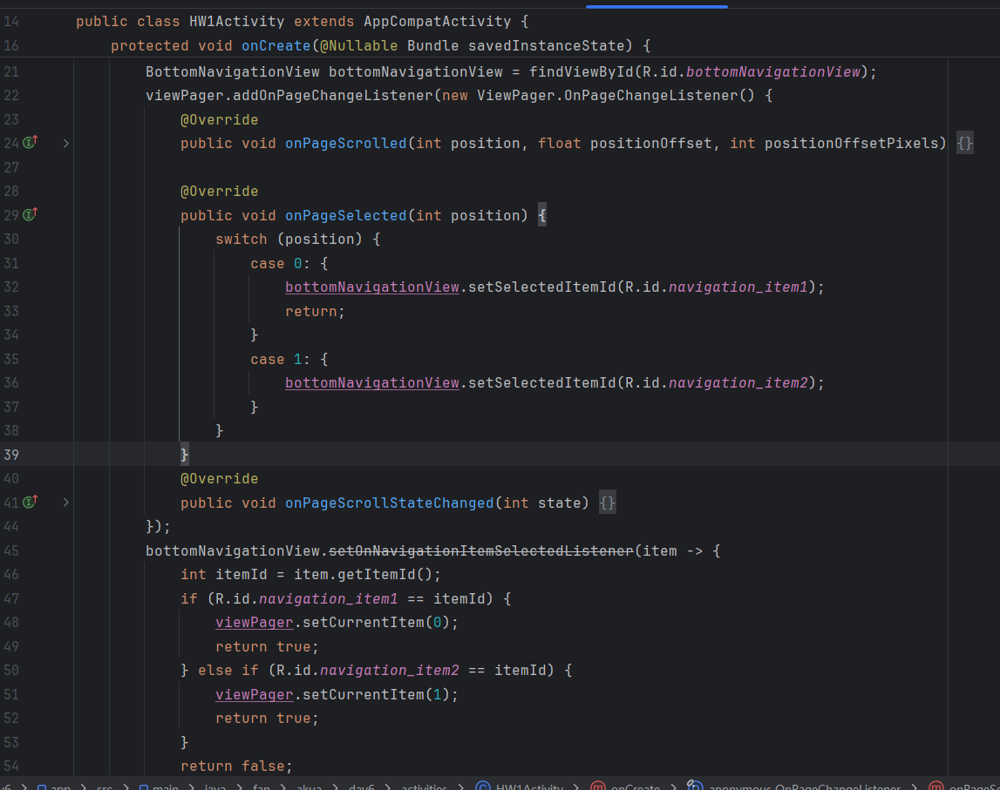
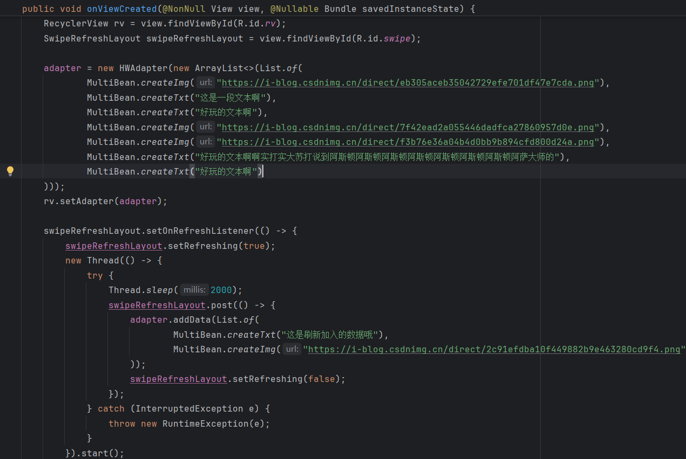
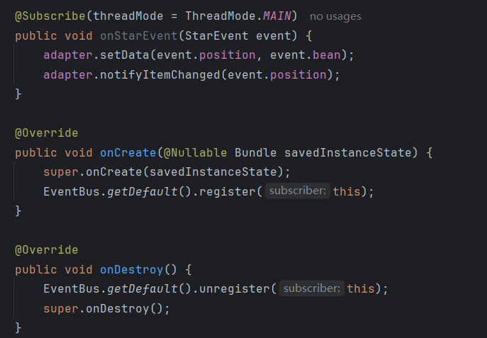
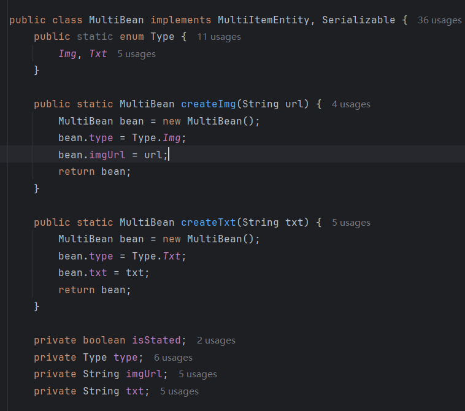
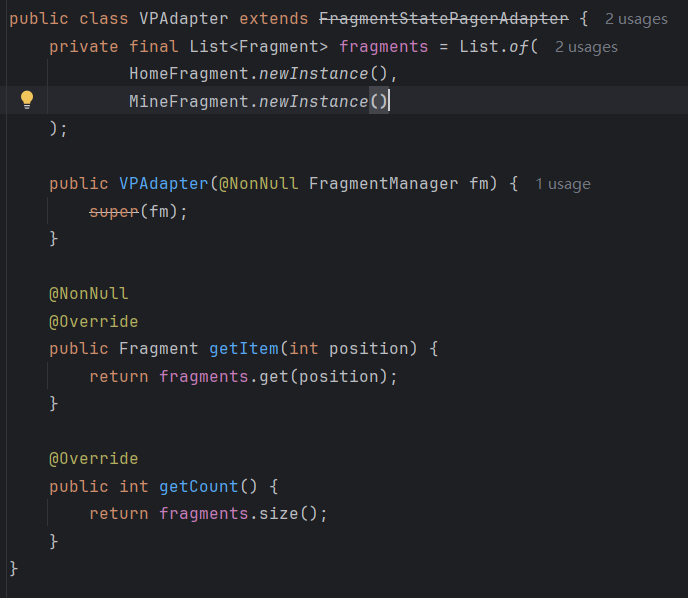
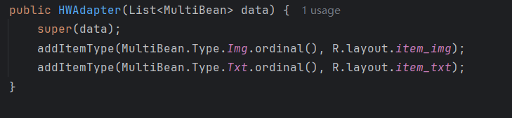
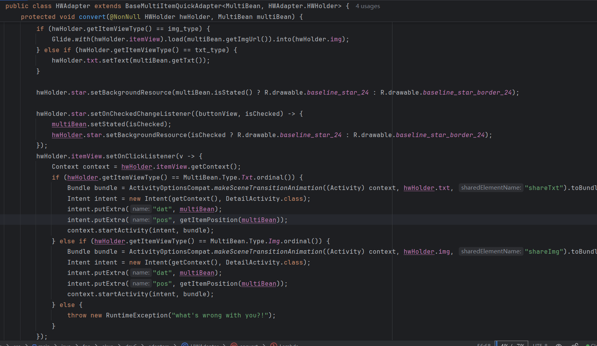
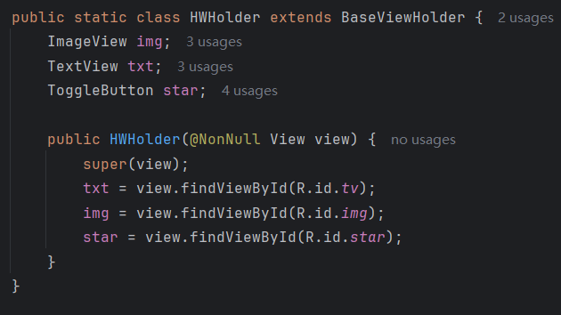

## Day6-HW1

相关的文件如下：
1. [DetailActivity.java](app/src/main/java/fan/akua/day6/activities/DetailActivity.java)
2. [HW1Activity.java](app/src/main/java/fan/akua/day6/activities/HW1Activity.java)
3. [HWAdapter.java](app/src/main/java/fan/akua/day6/adapters/HWAdapter.java)
4. [VPAdapter.java](app/src/main/java/fan/akua/day6/adapters/VPAdapter.java)
5. [MultiBean.java](app/src/main/java/fan/akua/day6/bean/MultiBean.java)
6. [StarEvent.java](app/src/main/java/fan/akua/day6/events/StarEvent.java)
7. [HomeFragment.java](app/src/main/java/fan/akua/day6/fragments/HomeFragment.java)
8. [MineFragment.java](app/src/main/java/fan/akua/day6/fragments/MineFragment.java)
9. [activity_detail.xml](app/src/main/res/layout/activity_detail.xml)
10. [activity_hw1.xml](app/src/main/res/layout/activity_hw1.xml)
11. [fragment_home.xml](app/src/main/res/layout/fragment_home.xml)
12. [item_img.xml](app/src/main/res/layout/item_img.xml)
13. [item_txt.xml](app/src/main/res/layout/item_txt.xml)

### 确定大体结构

今天这个还算可以，稍稍有点难度。
总体来说，一个Activity使用BottomNavigationView和ViewPager展示两个Fragment。HomeFragment中使用SwipeRefreshLayout嵌套RecyclerView。

RecyclerView就采用BRVAH设置数据，多类型和更新写起来比较方便。
点击Item，使用共享动画跳转到另一个Activity，同时Intent传递数据。
在新Activity中，修改“喜欢”会使用EventBus发布广播，在HomeFragment中监听并修改adapter的数据。

### 编写Activity

比较常规了



布局如下

```xml
<?xml version="1.0" encoding="utf-8"?>
<androidx.constraintlayout.widget.ConstraintLayout xmlns:android="http://schemas.android.com/apk/res/android"
    xmlns:app="http://schemas.android.com/apk/res-auto"

    android:layout_width="match_parent"
    android:layout_height="match_parent">

    <com.google.android.material.bottomnavigation.BottomNavigationView
        android:id="@+id/bottomNavigationView"
        android:layout_width="0dp"
        android:layout_height="wrap_content"
        app:layout_constraintBottom_toBottomOf="parent"
        app:layout_constraintEnd_toEndOf="parent"
        app:layout_constraintStart_toStartOf="parent"
        app:menu="@menu/bottom_nav_menu" />

    <androidx.viewpager.widget.ViewPager
        android:id="@+id/vp"
        android:name="fan.akua.day3.fragments.VP1Fragment"
        android:layout_width="match_parent"
        android:layout_height="0dp"
        app:layout_constraintBottom_toTopOf="@+id/bottomNavigationView"
        app:layout_constraintEnd_toEndOf="parent"
        app:layout_constraintStart_toStartOf="parent"
        app:layout_constraintTop_toTopOf="parent" />
</androidx.constraintlayout.widget.ConstraintLayout>
```

### 编写HomeFragment

布局很简单

```xml
<?xml version="1.0" encoding="utf-8"?>
<androidx.swiperefreshlayout.widget.SwipeRefreshLayout xmlns:android="http://schemas.android.com/apk/res/android"
    xmlns:app="http://schemas.android.com/apk/res-auto"
    android:id="@+id/swipe"
    android:layout_width="match_parent"
    android:layout_height="match_parent">

    <androidx.recyclerview.widget.RecyclerView
        android:id="@+id/rv"
        android:layout_width="match_parent"
        android:layout_height="match_parent"
        app:layoutManager="androidx.recyclerview.widget.StaggeredGridLayoutManager"
        app:spanCount="2" />

</androidx.swiperefreshlayout.widget.SwipeRefreshLayout>
```

代码整体逻辑也不难，在onViewCreated中设置rv的适配器，再设置一下刷新的事件。



然后订阅EventBus



### 确定数据结构

先确定一下多类型的数据结构



### 编写适配器

先来简单的，ViewPager的适配器



接下来是重头戏，RV的适配器

先设置两种布局



在convert中设置监听，同时**重置所有控件状态**
重置很重要，RV的复用是一个大坑。具体也没啥好解释的，不说了。



最后定义一下ViewHolder



### 运行效果如下

[视频无法播放请点击我](vx_images/Screen_recording_20240824_191130.mp4)

<div>
    <video src="vx_images/Screen_recording_20240824_191130.mp4"></video>
</div>
