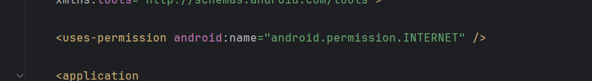
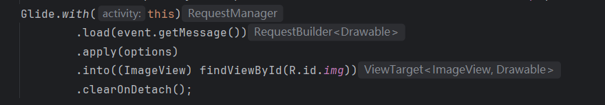
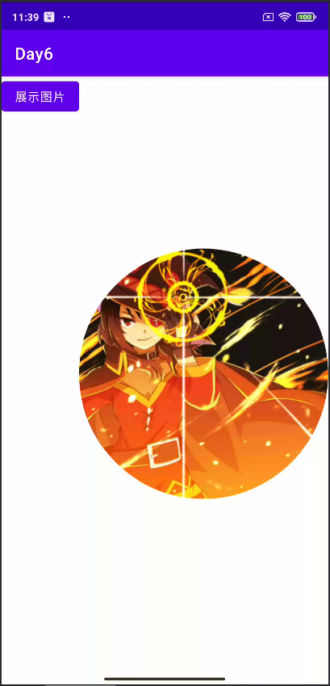

## Day6-Train1

相关的文件如下：
1. [MainActivity.java](app/src/main/java/fan/akua/day6/activities/MainActivity.java)
2. [activity_main.xml](app/src/main/res/layout/activity_main.xml)


### 引入库

```gradle
implementation libs.glide
```

我使用了toml，就不展示了。

### 声明权限



### 编写Activity



### 运行效果如下

