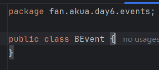
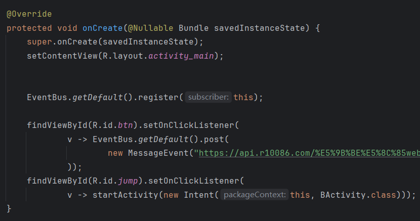
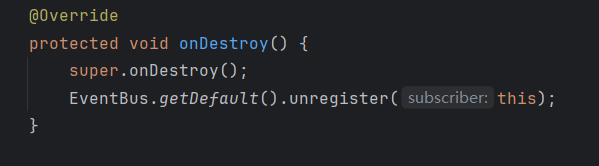
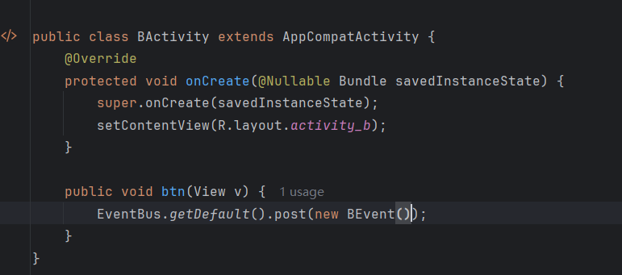

## Day6-Train2

相关的文件如下：
1. [MainActivity.java](app/src/main/java/fan/akua/day6/activities/MainActivity.java)
2. [BActivity.java](app/src/main/java/fan/akua/day6/activities/BActivity.java)
2. [activity_main.xml](app/src/main/res/layout/activity_main.xml)
3. [BEvent.java](app/src/main/java/fan/akua/day6/events/BEvent.java)

### 引入库

```gradle
implementation libs.eventbus
```

我使用了toml，就不展示了。

### 定义Event



### 编写Activity

三部分，首先在onCreate订阅，然后定义函数接收，最后在onDestroy取消订阅






### 编写BActivity

不需要订阅，直接发布事件即可




### 运行效果如下

[视频无法播放请点击我](vx_images/Screen_recording_20240824_114535.mp4)

<div>
    <video src="vx_images/Screen_recording_20240824_114535.mp4"></video>
</div>


