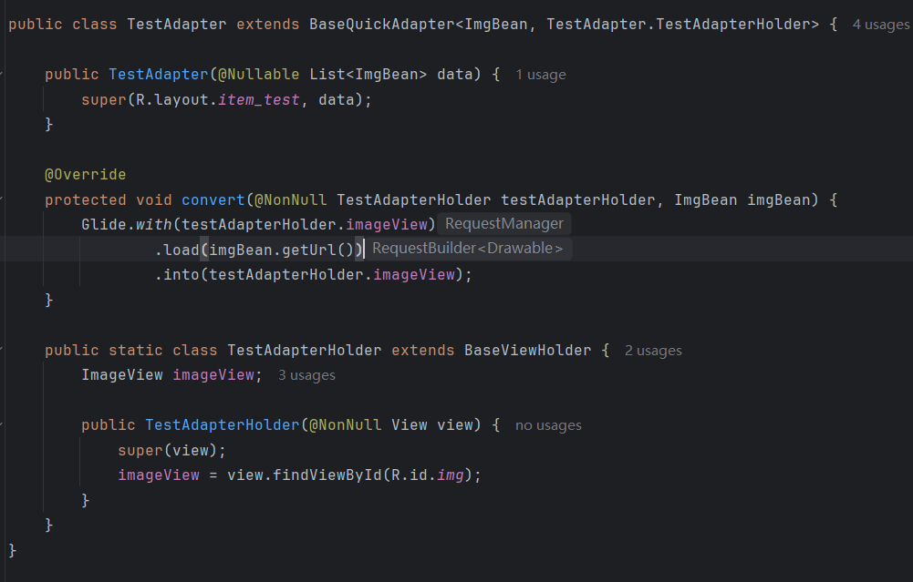
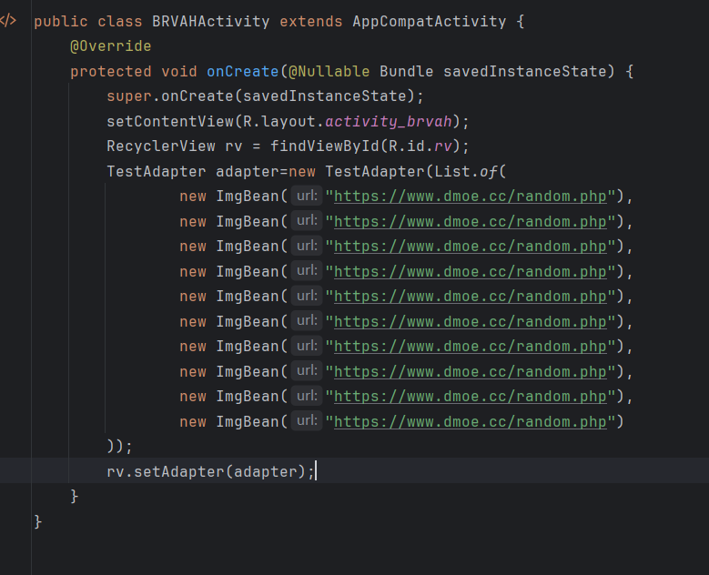
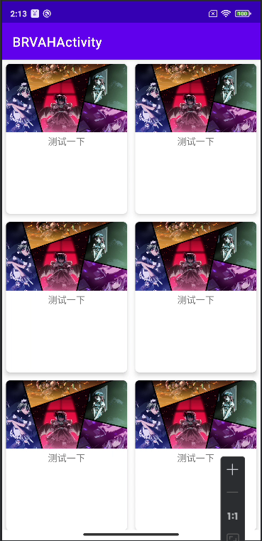

## Day6-Train3

相关的文件如下：
1. [BRVAHActivity.java](app/src/main/java/fan/akua/day6/activities/BRVAHActivity.java)
2. [TestAdapter.java](app/src/main/java/fan/akua/day6/adapters/TestAdapter.java)
2. [ImgBean.java](app/src/main/java/fan/akua/day6/bean/ImgBean.java)
3. [activity_brvah.xml](app/src/main/src/layout/activity_brvah.xml)

### 引入库

```gradle
 implementation "io.github.cymchad:BaseRecyclerViewAdapterHelper:3.0.14"
```

### 定义Adapter



### 编写Activity



### 运行效果如下



小小吐槽一下，这个框架真的很多人用吗？我感觉不如liuqiangdong666的BRV啊。

