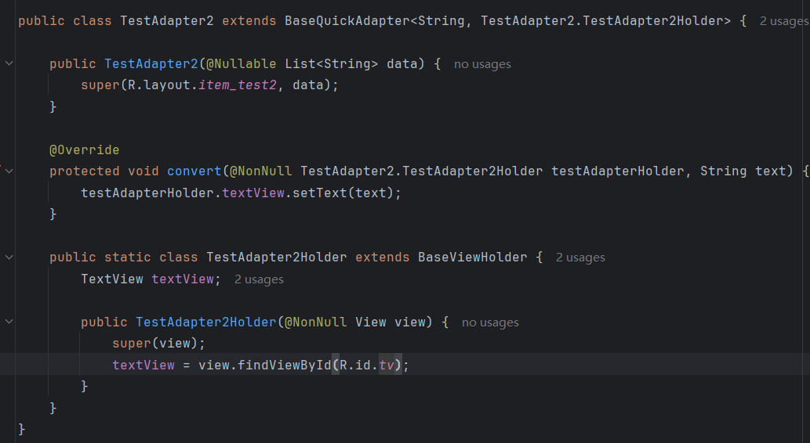
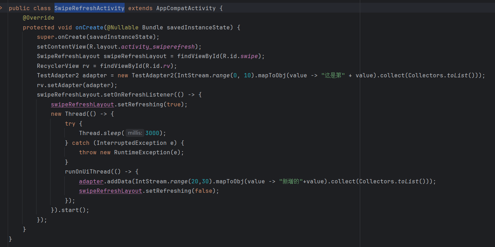

## Day6-Train4

相关的文件如下：
1. [SwipeRefreshActivity.java](app/src/main/java/fan/akua/day6/activities/SwipeRefreshActivity.java)
2. [TestAdapter2.java](app/src/main/java/fan/akua/day6/adapters/TestAdapter2.java)
3. [activity_swiperefresh.xml](app/src/main/res/layout/activity_swiperefresh.xml)

### 引入库

```gradle
implementation libs.swiperefreshlayout
```

我使用了toml，就不展示了。

### 定义Adapter



### 编写Activity



### 运行效果如下

[视频无法播放请点击我](vx_images/Screen_recording_20240824_150349.mp4)

<div>
    <video src="vx_images/Screen_recording_20240824_150349.mp4"></video>
</div>
