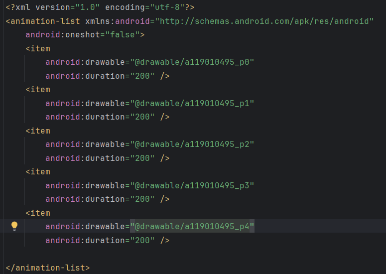
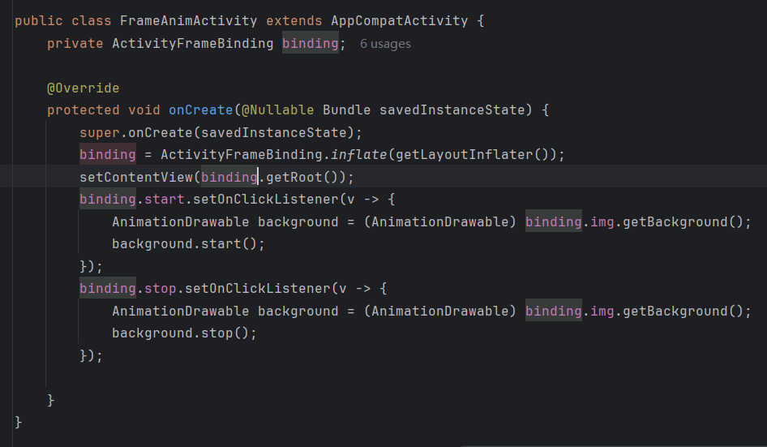

## Day7-Train1

相关的文件如下：
1. [FrameAnimActivity.java](app/src/main/java/fan/akua/day7/activities/FrameAnimActivity.java)
2. [anim_frame.xml](app/src/main/res/drawable/anim_frame.xml)

帧动画踩坑老师忘记说了，这玩意很吃内存和性能，他是一次加载进去的。远古事情都避免使用这个，因为容易OOM。

### 编写anim

### 编写Activity

### 运行效果如下

[视频无法播放请点击我](vx_images/Screen_recording_20240825_084119.mp4)

    <video src="vx_images/Screen_recording_20240825_084119.mp4"></video>

