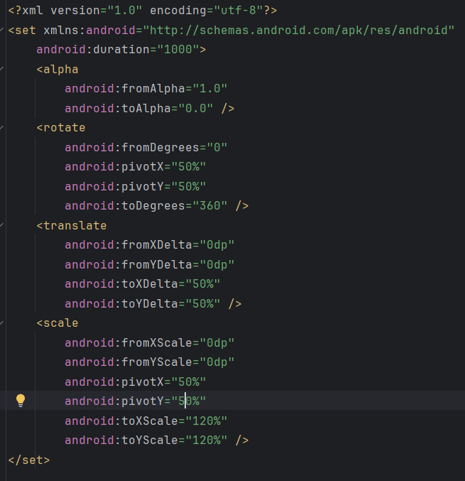

## Day7-Train4

相关的文件如下：
1. [AlphaActivity.java](app/src/main/java/fan/akua/day7/activities/AlphaActivity.java)
2. [anim_set.xml](app/src/main/res/layout/anim_set.xml)

### 编写anim



### 编写代码

代码较长
```java
ScaleAnimation scaleAnimation = new ScaleAnimation(
                    1f, 1.2f,
                    1f, 1.2f,
                    Animation.RELATIVE_TO_SELF, 0.5f,
                    Animation.RELATIVE_TO_SELF, 0.5f
            );
            scaleAnimation.setDuration(1000);
            scaleAnimation.setRepeatCount(4);

            RotateAnimation rotateAnimation = new RotateAnimation(
                    0f, 360f,
                    Animation.RELATIVE_TO_SELF, 0.5f,
                    Animation.RELATIVE_TO_SELF, 0.5f
            );
            rotateAnimation.setDuration(1000);

            AlphaAnimation alphaAnimation = new AlphaAnimation(
                    1f, 0f
            );
            alphaAnimation.setDuration(1000);
            alphaAnimation.setRepeatMode(Animation.REVERSE);
            alphaAnimation.setRepeatCount(5);

            AnimationSet animationSet = new AnimationSet(true);
            animationSet.addAnimation(scaleAnimation);
            animationSet.addAnimation(rotateAnimation);
            animationSet.addAnimation(alphaAnimation);

            animationSet.setStartOffset(0);

            binding.img.startAnimation(animationSet);
```

### 运行效果如下

[视频无法播放请点击我](vx_images/Screen_recording_20240825_111252.mp4)

<div>
    <video src="vx_images/Screen_recording_20240825_111252.mp4"></video>
</div>
