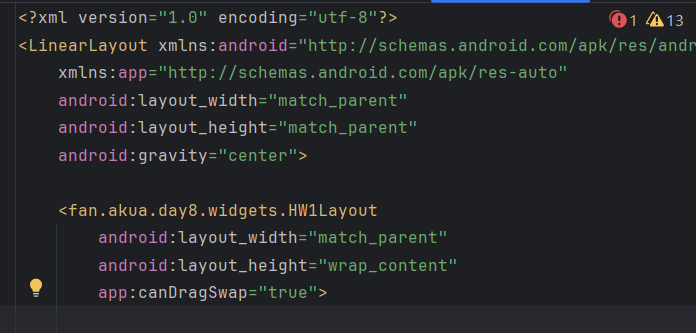

## Day8-HW1

相关的文件如下：
1. [test_attr.xml](app/src/main/res/values/test_attr.xml)
2. [HW1Layout.java](app/src/main/java/fan/akua/day8/widgets/HW1Layout.java)

相比于任务2、3，多了一个自定义属性，既然如此那我就添加一个属性，控制是否可以拖动交换。

### 编写attrs

```xml
<?xml version="1.0" encoding="utf-8"?>
<resources>
    <declare-styleable name="test">
        <attr name="canDragSwap" format="boolean" />
    </declare-styleable>
</resources>
```

### 编写ViewGroup

主要来说就是新增了一个attr，整体代码就不放了。

```java
    private void init(Context context, AttributeSet attrs) {
        mTouchSlop = ViewConfiguration.get(getContext()).getScaledPagingTouchSlop();
        // 实现的'try'-with-resources真鸡肋，不用就报黄，用了还有性能开销。
        TypedArray ta = context.obtainStyledAttributes(attrs, R.styleable.HW1Layout_attrs);
        canDrag = ta.getBoolean(R.styleable.HW1Layout_attrs_canDragSwap, true);
        ta.recycle();
    }
    @Override
    public boolean onInterceptTouchEvent(MotionEvent ev) {
        if (!canDrag) return false;
        return isDragging;
    }
    @Override
    public boolean onTouchEvent(MotionEvent event) {
        if (!canDrag) return false;
        ...
    }

```

### 在布局使用



### 运行效果如下

[视频无法播放请点击我](vx_images/20240826_170632.mp4)

<div>
    <video src="vx_images/20240826_170632.mp4"></video>
</div>
