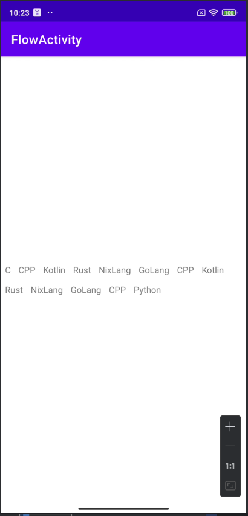

## Day8-Train2

相关的文件如下：
1. [TestViewGroup.java](app/src/main/java/fan/akua/day8/widgets/TestViewGroup.java)

> 纸上得来终觉浅，绝知此事要躬行。
> 说实话这是我写安卓这么多年第一次自定义ViewGroup。

### 编写代码

在onMeasure中，记录需要几行，每行哪些View，每行多高。

注意判断一下Visibility

```java
    @SuppressLint("DrawAllocation")
@Override
protected void onMeasure(int widthMeasureSpec, int heightMeasureSpec) {
    lines.clear();
    heights.clear();

    int paddingLeft = getPaddingLeft();
    int paddingRight = getPaddingRight();
    int paddingTop = getPaddingTop();
    int paddingBottom = getPaddingBottom();

    int widthSize = MeasureSpec.getSize(widthMeasureSpec);
    int heightSize = MeasureSpec.getSize(heightMeasureSpec);

    List<View> lineViews = new ArrayList<>();
    int lineWidth = 0;
    int lineHeight = 0;

    int parentWith = 0;
    int parentHeight = 0;

    int count = getChildCount();
    for (int i = 0; i < count; i++) {
        View view = getChildAt(i);

        // 这玩意确实有必要
        if (view.getVisibility() == View.GONE) continue;

        LayoutParams params = view.getLayoutParams();

        int childWidthMeasureSpec = getChildMeasureSpec(widthMeasureSpec, paddingLeft + paddingRight, params.width);
        int childHeightMeasureSpec = getChildMeasureSpec(heightMeasureSpec, paddingTop + paddingBottom, params.height);
        view.measure(childWidthMeasureSpec, childHeightMeasureSpec);

        int childMeasuredWidth = view.getMeasuredWidth();
        int childMeasuredHeight = view.getMeasuredHeight();

        // 超出了
        if (childMeasuredWidth + lineWidth > widthSize) {
            // 记录这行所有View
            lines.add(lineViews);
            // 记录这行的高度
            heights.add(lineHeight);

            parentHeight = parentHeight + lineHeight;
            parentWith = Math.max(parentWith, lineWidth);

            // 重置
            lineViews = new ArrayList<>();
            lineWidth = 0;
            lineHeight = 0;
        }

        lineViews.add(view);

        lineWidth = lineWidth + childMeasuredWidth;
        lineHeight = Math.max(lineHeight, childMeasuredHeight);
    }
    // 最后一行
    lines.add(lineViews);
    heights.add(lineHeight);
    parentHeight = parentHeight + lineHeight;
    parentWith = Math.max(parentWith, lineWidth);

    int widthMode = MeasureSpec.getMode(widthMeasureSpec);
    int heightMode = MeasureSpec.getMode(heightMeasureSpec);

    int finalWidth = (widthMode == MeasureSpec.EXACTLY) ? widthSize : parentWith;
    int finalHeight = (heightMode == MeasureSpec.EXACTLY) ? heightSize : parentHeight;
    setMeasuredDimension(finalWidth, finalHeight);
}
```

onLayout中，读取onMeasure时记录的数据，然后对着摆放即可。

```java
    @Override
protected void onLayout(boolean changed, int l, int t, int r, int b) {
    int lineCount = lines.size();

    int currentL = getPaddingLeft();
    int currentT = getPaddingTop();

    for (int i = 0; i < lineCount; i++) {
        List<View> views = lines.get(i);

        int lineHeight = heights.get(i);
        for (int j = 0; j < views.size(); j++) {
            View view = views.get(j);

            int right = currentL + view.getMeasuredWidth();
            int bottom = currentT + view.getMeasuredHeight();
            view.layout(currentL, currentT, right, bottom);
            currentL = right;
        }
        // 每行都重置
        currentT = currentT + lineHeight;
        currentL = getPaddingLeft();
    }
}
```


### 运行效果如下



测试布局如下

````xml
<?xml version="1.0" encoding="utf-8"?>
<LinearLayout xmlns:android="http://schemas.android.com/apk/res/android"
    android:layout_width="match_parent"
    android:layout_height="match_parent"
    android:gravity="center">

    <fan.akua.day8.widgets.TestViewGroup
        android:layout_width="match_parent"
        android:layout_height="wrap_content">

        <TextView
            android:layout_width="wrap_content"
            android:layout_height="wrap_content"
            android:padding="6dp"
            android:text="C" />

        <TextView
            android:layout_width="wrap_content"
            android:layout_height="wrap_content"
            android:padding="6dp"
            android:text="CPP" />

        <TextView
            android:layout_width="wrap_content"
            android:layout_height="wrap_content"
            android:padding="6dp"
            android:text="Kotlin" />

        <TextView
            android:layout_width="wrap_content"
            android:layout_height="wrap_content"
            android:padding="6dp"
            android:text="Rust" />

        <TextView
            android:layout_width="wrap_content"
            android:layout_height="wrap_content"
            android:padding="6dp"
            android:text="NixLang" />

        <TextView
            android:layout_width="wrap_content"
            android:layout_height="wrap_content"
            android:padding="6dp"
            android:text="GoLang" />

        <TextView
            android:layout_width="wrap_content"
            android:layout_height="wrap_content"
            android:padding="6dp"
            android:text="CPP" />

        <TextView
            android:layout_width="wrap_content"
            android:layout_height="wrap_content"
            android:padding="6dp"
            android:text="Kotlin" />

        <TextView
            android:layout_width="wrap_content"
            android:layout_height="wrap_content"
            android:padding="6dp"
            android:text="Rust" />

        <TextView
            android:layout_width="wrap_content"
            android:layout_height="wrap_content"
            android:padding="6dp"
            android:text="NixLang" />

        <TextView
            android:layout_width="wrap_content"
            android:layout_height="wrap_content"
            android:padding="6dp"
            android:text="GoLang" />

        <TextView
            android:layout_width="wrap_content"
            android:layout_height="wrap_content"
            android:padding="6dp"
            android:text="CPP" />

        <TextView
            android:layout_width="wrap_content"
            android:layout_height="wrap_content"
            android:padding="6dp"
            android:text="Python" />
    </fan.akua.day8.widgets.TestViewGroup>

</LinearLayout>
```
