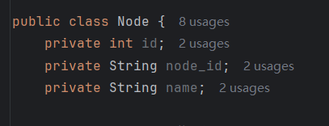

## Day9-HW1

相关的文件如下：

1. [HW2Activity.kt](app/src/main/java/fan/akua/day9/activities/HW2Activity.kt)

### 定义Bean

这里就取几个关键的



### 编写okhttp

老代码，封装一个回调

```kotlin
private fun asyncOkhttpRequest(url: String, callback: (String?) -> Unit) {
    val client = OkHttpClient()
    val request = Request.Builder()
        .url(url)
        .build()

    client.newCall(request).enqueue(object : Callback {
        override fun onFailure(call: okhttp3.Call, e: IOException) {
            callback(null)
        }

        override fun onResponse(call: okhttp3.Call, response: Response) {
            callback(response.body()?.string())
        }
    })
}
```

解析数据

```kotlin
 asyncOkhttpRequest("https://api.github.com/users/octocat/repos") { response ->

    val nodes = Gson().fromJson(response, Array<Node>::class.java)

    val result = nodes.joinToString(separator = "\n") { item ->
        "id: ${item.id}\nname: ${item.name}\nnode_id: ${item.node_id}\n----\n"
    }
    runOnUiThread {
        binding.showTv.text = result
    }
}
```

### 编写Retrofit

定义接口

```kotlin
public interface GithubService {

    @GET("users/octocat/repos")
    Call<List<Node>> getUserRepo();

}
```

发出请求

```kotlin
val retrofit = Retrofit.Builder()
    .baseUrl("https://api.github.com/")
    .addConverterFactory(GsonConverterFactory.create())
    .build()
val service = retrofit.create(GithubService::class.java)
service.userRepo.enqueue(object : retrofit2.Callback<List<Node>> {
    override fun onResponse(
        call: Call<List<Node>>,
        response: retrofit2.Response<List<Node>>
    ) {
        val result = response.body()?.joinToString(separator = "\n") { item ->
            "id: ${item.id}\nname: ${item.name}\nnode_id: ${item.node_id}\n----\n"
        }
        runOnUiThread {
            binding.showTv.text = result
        }
    }

    override fun onFailure(call: Call<List<Node>>, t: Throwable) {

    }

})
```

### 运行效果如下

[视频无法播放请点击我](vx_images/Screen_recording_20240827_160830.mp4)

<div>
    <video src="vx_images/Screen_recording_20240827_160830.mp4"></video>
</div>
