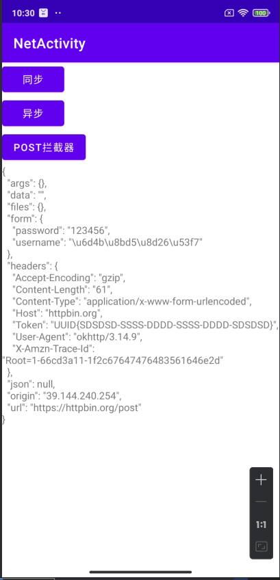

## Day8-Train4

相关的文件如下：

1. [NetActivity.kt](app/src/main/java/fan/akua/day9/activities/NetActivity.kt)
2. [AddHeaderInterceptor.java](app/src/main/java/fan/akua/day9/interceptors/AddHeaderInterceptor.java)

用了httpbin.org，可以回显请求信息。
我这里模拟了常见情景，请求api时用拦截器附加token。

### 编写代码

### 运行效果如下

