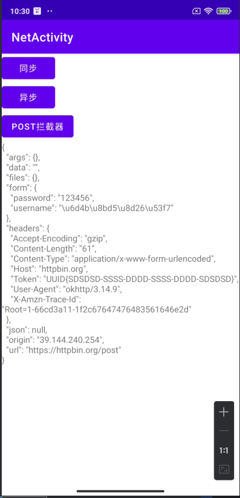

## Day8-Train5

相关的文件如下：

1. [HandlerActivity.kt](app/src/main/java/fan/akua/day9/activities/HandlerActivity.kt)

太简单了。

### 编写代码

```kotlin
 private lateinit var binding: ActivityHandlerBinding
    private val handler = Handler(Looper.getMainLooper())
    private var time = 10000
    private val runnable = object : Runnable {
        override fun run() {
            if (time == 0) {
                binding.tv.text = "倒计时结束"
                return
            }
            binding.tv.text = "剩余时间：$time"
            time -= 1000
            handler.postDelayed(this, 1000)
        }
    }

    override fun onCreate(savedInstanceState: Bundle?) {
        super.onCreate(savedInstanceState)
        binding = ActivityHandlerBinding.inflate(layoutInflater)
        setContentView(binding.root)

        binding.start.setOnClickListener {
            handler.postDelayed(runnable, 1000)
        }
    }

    override fun onDestroy() {
        handler.removeCallbacks(runnable)
        super.onDestroy()
    }
```

### 运行效果如下



### 运行效果如下

[视频无法播放请点击我](vx_images/Screen_recording_20240827_105810.mp4)

<div>
    <video src="vx_images/Screen_recording_20240827_105810.mp4"></video>
</div>
