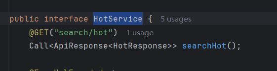
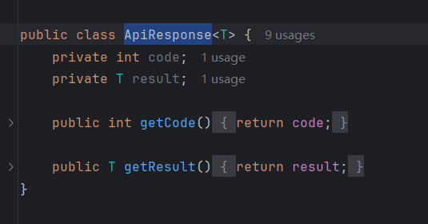
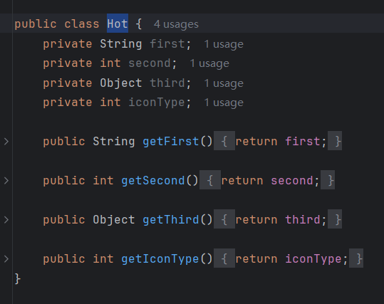
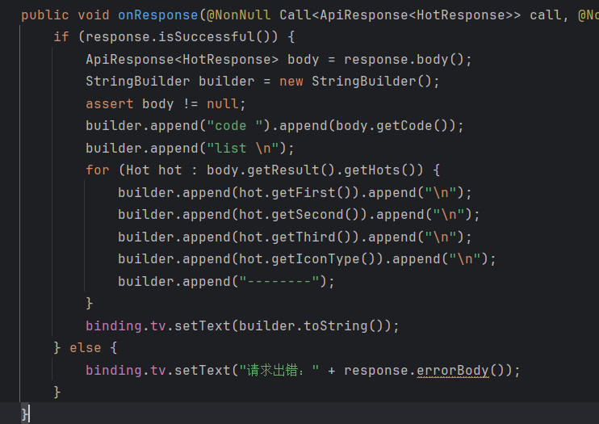
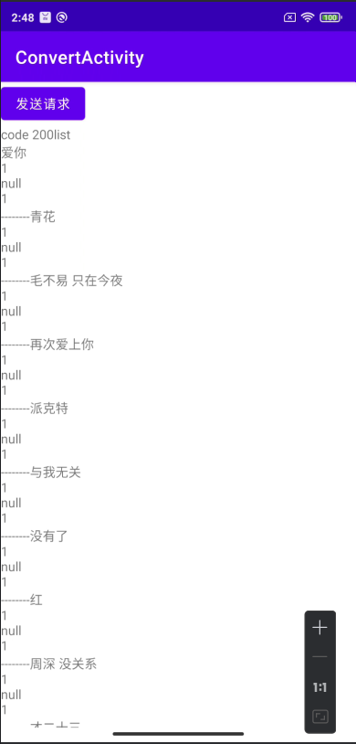

## Day8-Train6

相关的文件如下：

1. [ConvertActivity.java](app/src/main/java/fan/akua/day9/activities/ConvertActivity.java)
2. [ApiResponse.java](app/src/main/java/fan/akua/day9/bean/ApiResponse.java)
3. [HotService.java](app/src/main/java/fan/akua/day9/api/HotService.java)
4. [Hot.java](app/src/main/java/fan/akua/day9/bean/Hot.java)
5. [HotResponse.java](app/src/main/java/fan/akua/day9/bean/HotResponse.java)

太简单了。

### 确定返回样式

这里采用网易云音乐api接口`http://193.112.200.228/search/hot`

```json
{
    "code": 200,
    "result": {
        "hots": [
            {
                "first": "爱你",
                "second": 1,
                "third": null,
                "iconType": 1
            },
            {
                "first": "青花",
                "second": 1,
                "third": null,
                "iconType": 1
            },
            {
                "first": "毛不易 只在今夜",
                "second": 1,
                "third": null,
                "iconType": 1
            }
        ]
    }
}
```

### 编写接口



### 确定响应体

先封装一个base





### 执行请求

```java
 Retrofit retrofit = new Retrofit.Builder()
                    .baseUrl("http://193.112.200.228")
                    .addConverterFactory(GsonConverterFactory.create())
                    .build();

            HotService service = retrofit.create(HotService.class);
            Call<ApiResponse<HotResponse>> apiResponseCall = service.searchHot();
            apiResponseCall.enqueue(new Callback<ApiResponse<HotResponse>>() {
                    ...
                });
```

### 运行效果如下

这里直接拼接成String显示了



