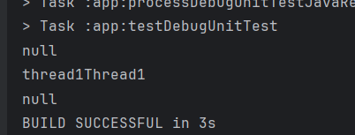

## Day8-Train7

相关的文件如下：

1. [ExampleUnitTest.java](app/src/test/java/fan/akua/day9/ExampleUnitTest.java)

直接写个单元测试得了

### 编写代码

```java
public class ExampleUnitTest {
    @Test
    public void test_thread() throws InterruptedException {
        ThreadLocal<String> tl = new ThreadLocal<>();
        Thread thread1 = new Thread(new Runnable() {
            @Override
            public void run() {
                tl.set("Thread1");
                System.out.println("thread1" + tl.get());
            }
        });
        System.out.println(tl.get());
        thread1.start();
        Thread.sleep(100);
        System.out.println(tl.get());
    }
}
```

### 运行效果如下



### 小结

ThreadLocal简单来说就是线程作用域的HashMap。
Thread和Looper借助ThreadLocal关联。
我在前几个月正好写过一篇Handler的完全解析。
[安卓应用内通信的核心-Handler](https://blog.csdn.net/qq_38177830/article/details/140062583)